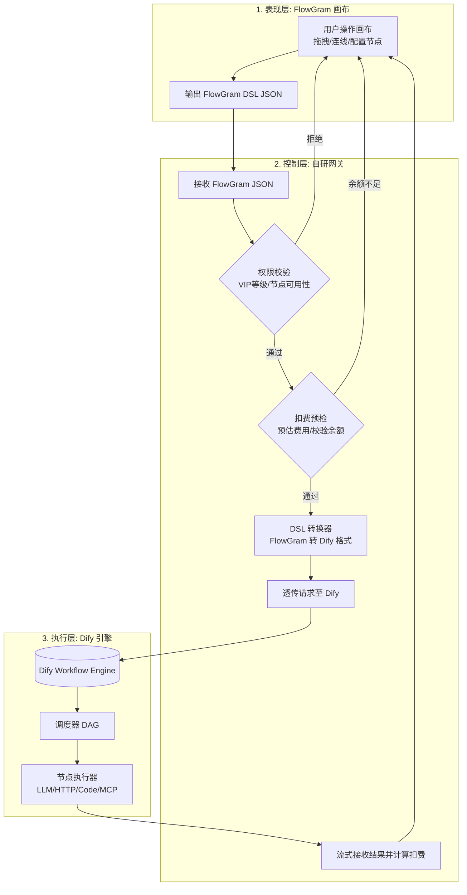

# futureFlow：可部署的 AI 工作流平台

futureFlow 是一个面向单账号/个人开发者场景的 AI 工作流平台：可视化编排、草稿/发布快照与版本历史、平台 API、模板建流、Webhook/定时自动化、运行审计、计费保护和管理员运维均可用，每次线上调用都会经过鉴权、准入、运行记录和计费流水。它不是静态演示页。

> 当前明确不包含团队空间、成员管理和 RBAC：它们需要以租户数据模型为基础，不能用现有单用户字段临时拼接。

---

## 快速开始

### 一键启动

**Windows（推荐）：**

```bat
start.bat
```

**跨平台（pnpm 命令）：**

```bash
# 1. 创建环境变量文件（首次启动自动生成）
pnpm run env:init

# 2. 安装依赖
pnpm install

# 3. 一键启动完整服务
pnpm start
```

启动脚本会自动完成：

1. 从 `.env.example` 复制生成 `.env`（首次启动）
2. 安装 pnpm workspace 依赖
3. 启动全部 Docker Compose 服务（PostgreSQL、Dify API/Worker/Web、代码 Sandbox、SSRF Proxy、Redis、Weaviate）
4. 等待数据库、SSRF Proxy、Sandbox 与 Dify API 健康，并等待 Dify 初始化任务成功退出
5. 自动创建 Dify 管理员和 futureFlow 管理员，将 Dify Console 会话加密保存到 PostgreSQL
6. 发布工作流时自动创建独立 Dify 应用、导入 DSL、发布并生成独立执行 Key
7. 为 PostgreSQL、网关 JWT、Dify 等生成本机随机密钥（futureFlow 管理员默认密码为固定值 `futureFlow@`，可在 `.env` 中覆盖）

首次使用只需在 `.env` 填写模型供应商的 `LLM_API_KEY`（以及需要时调整模型地址/名称）；Dify Console 授权、应用和执行 Key 不需要手工配置。

### 模型与 Dify 依赖（重要）

> **先澄清本文的「云端」指什么**：本文把两种执行方式分别叫**「本地试运行」**和**「云端试运行 / 发布后执行」**——前者是浏览器画布上点「试运行」直接跑（本地扩展节点如 Python 执行只能这样跑），后者是把工作流导入 Docker 里的 Dify 容器、由 Dify 执行。**这里的「云端」与「是否部署在云服务器」无关**：即使你把整套服务部署在一台物理服务器上，只要工作流是交给 Dify 容器执行的，本文就称之为「云端执行」。之所以区分，是因为两条链路的可用节点范围不同（见「关键节点能力」）。

- **Dify 是必需依赖**：知识库、MCP、发布后云端执行、草稿云端试运行都走本地 Dify 容器栈。Dify 未启动时相关接口会**直接报错**（不做静默降级）。
- `.env` 中填写 `LLM_API_KEY` / `LLM_API_HOST` / `LLM_DEFAULT_MODEL`（OpenAI 兼容，如 `https://matchfit.top/v1` + `glm-5.3-flash`）：画布「试运行」的大语言模型节点经网关代理 `POST /llm/chat/completions` 真实调用，密钥只保存在服务端。
- `POSTGRES_PASSWORD`、`GATEWAY_JWT_SECRET` 必须至少 32 个字符（网关启动校验），`env:init` 会自动生成。

### 访问地址

| 服务          | 地址                          | 说明                           |
| ------------- | ----------------------------- | ------------------------------ |
| FlowGram 画布 | http://localhost:3000         | 拖拽编排工作流                 |
| 网关 API      | http://localhost:3001         | 鉴权/扣费/DSL 转换             |
| Dify 控制台   | http://localhost:8080         | 可选的 Dify 状态查看与高级运维 |
| 健康检查      | http://localhost:3001/healthz | 网关和数据库就绪状态           |

### 测试账号与管理员（本地默认）

| 项       | 值                              |
| -------- | ------------------------------- |
| 登录地址 | http://localhost:3000/login     |
| 用户名   | `admin`                         |
| 密码     | `futureFlow@`                   |
| 角色     | 管理员（可访问「平台管理」后台） |

> 密码里的 `@` 必须是半角；中文输入法打成全角 `＠` 会认证失败，登录页会实时提示。

- 管理员后台：http://localhost:3000/admin，提供仪表盘（用户/Key/工作流/运行数/Token/费用/7 天趋势）、用户管理（调整余额/修改 VIP/封禁/删除）、全站 API Key 吊销，以及工作流、运行记录与余额流水。
- 账号由网关首次启动时自动创建，取值来自 `.env` 的 `GATEWAY_BOOTSTRAP_ADMIN_*`；账号已存在时不会重复创建或覆盖，应用日志不会输出密码；设置 `GATEWAY_BOOTSTRAP_ADMIN_ENABLED=false` 可关闭后续初始化。
- 安全：改密后旧密码立即失效并强制下线其他会话（tokenVersion 机制）；15 分钟内失败 8 次会锁定该「IP+账号」15 分钟（正确密码也会被拒），**重启网关即可立即清除计数**，或用 `.env` 的 `LOGIN_RATE_LIMIT_*` 放宽；旧 `.env` 首次启动自动迁移到环境格式 v2；从旧版本升级时如果仍有使用公开旧密码的 `demo` 管理员，请先登录修改、封禁或删除。

---

## 部署

### 1. 配置 `.env`

```bash
pnpm run env:init
```

从 `.env.example` 生成 `.env`（已存在则不覆盖），并**自动随机生成全部密钥**：两套 PostgreSQL 密码、`GATEWAY_JWT_SECRET`、`DIFY_KEY_ENCRYPTION_SECRET`、`DIFY_SECRET_KEY`、Dify 管理员密码等。你不需要手工编任何密钥。

**唯一必须手工填的是模型密钥**：

| 变量 | 说明 |
| ---- | ---- |
| `LLM_API_KEY` | 模型供应商密钥（默认 DeepSeek，见 `.env` 内注释里的获取地址）。服务端读取后安全同步到 Dify Provider，**不会进入画布或运行结果** |

按需调整的（多数部署不用动）：

| 变量 | 默认 | 何时要改 |
| ---- | ---- | -------- |
| `GATEWAY_PORT` / `PUBLIC_GATEWAY_URL` | 3001 | 端口冲突时。**两者必须一致** |
| `FRONTEND_PORT` | 3000 | 端口冲突时 |
| `CORS_ORIGIN` | `http://localhost:3000` | 前端不在本机 3000 时 |
| `POSTGRES_PORT` | 5432 | 被占用时（冲突会自动改用 5433-5450） |
| `GATEWAY_HOST` | `127.0.0.1` | 需要跨主机访问时改 `0.0.0.0`，并同步收紧 `CORS_ORIGIN` 与防火墙 |

> **密钥只在首次生成。** 已有 `.env` 时 `env:init` 只补齐缺失项，不会轮换已有值。特别地，轮换 `DIFY_KEY_ENCRYPTION_SECRET` 会让已加密的 Dify 凭据无法解密——确需轮换请先备份并按迁移流程处理。

生产模式下网关会拒绝不安全配置并直接启动失败：过短或仍是占位符的 JWT 密钥、示例数据库密码、通配符 CORS（`*`）、缺失的执行引擎配置、非正数的限流/超时参数。

### 2. 启动

```bash
pnpm install
pnpm start
```

`pnpm start` 一条命令完成：拉起全部 Docker 容器（两套 PostgreSQL、Redis、Weaviate、Dify API/Worker/Web/Sandbox、SSRF Proxy）→ 等待健康 → 执行数据库迁移 → 初始化 Dify 管理员授权与首个应用 → 启动网关与前端。

启动完成后访问 <http://localhost:3000>，用 `.env` 里的 `GATEWAY_BOOTSTRAP_ADMIN_USERNAME` / `GATEWAY_BOOTSTRAP_ADMIN_PASSWORD` 登录（默认 `admin`，密码在 `pnpm env:init` 时随机生成）。

需要分步执行时：

```bash
docker compose up -d                              # 1. 容器栈
pnpm --filter futureflow-gateway migration:run    # 2. 数据库迁移
pnpm --filter futureflow-gateway start:prod       # 3. 网关
pnpm --filter futureflow-frontend start           # 4. 前端
curl http://localhost:3001/healthz                # 健康检查
```

默认端口：前端 3000、网关 3001、Dify 控制台 8080、Dify API 5001、PostgreSQL 5432。网关与 Dify 均只绑定 `127.0.0.1`。

### 3. 端口冲突或绑定失败时

> 改 `GATEWAY_PORT` 时 `PUBLIC_GATEWAY_URL` 必须一起改。
> 若报 `EACCES: permission denied` 而不是「端口已被占用」，那是 Windows 把该端口**保留**给了 Hyper-V/WSL，不是被别的程序占用。用 `netsh int ipv4 show excludedportrange protocol=tcp` 查看保留区间（常见 `2926-3125`，正好盖住默认的 3000/3001）。换一个不在区间内的端口即可，例如 `GATEWAY_PORT=3401` + `PUBLIC_GATEWAY_URL=http://localhost:3401`，前端同理改 `FRONTEND_PORT`。
> **改了 `GATEWAY_PORT` 时别忘了媒体生成网关**：原生图片/视频节点发布后走「Dify → SSRF 代理 → 宿主网关」回调，这条链路要求三处端口一致——网关监听端口、`DIFY_MEDIA_GATEWAY_URL`/`DIFY_MEDIA_GATEWAY_PORT`、以及 SSRF 代理里的 `MEDIA_GATEWAY_PORT` 白名单。只改 `GATEWAY_PORT` 会让媒体节点以 **Squid 403** 失败。改完需重建 SSRF 代理让白名单重新生成：`docker compose up -d --force-recreate --no-deps ssrf_proxy`。

### 进阶：Dify 版本与依赖

`docker-compose.yml` 固定 Dify **0.15.3**、Dify Sandbox **0.2.10**。升级前必须对 DSL 转换、Console 导入、代码/HTTP 节点与 SSE 执行做兼容性回归。

Dify API 和 Worker 的代码、HTTP 节点依赖 Sandbox 与 SSRF Proxy，`pnpm start` 会按正确顺序等待健康；手动编排容器时也必须保持相同顺序。Dify 0.15.3 要求代码执行启用 Sandbox 网络，因此默认 `ENABLE_NETWORK=true`；Sandbox 与 Proxy 仅在隔离的 Docker 网络通信，不向宿主机暴露端口，HTTP(S) 出网必须经过带 ACL 的 SSRF Proxy。

SSRF Proxy 会拒绝 loopback、私网、link-local、云元数据和内部域名目标，生产部署仍应结合出口防火墙与 DNS 策略做第二层限制。若受控桌面环境把公网域名合成解析到 `198.18.0.0/15`，可通过 `DIFY_SSRF_SYNTHETIC_DNS_ALLOWED_DOMAINS` 逐个列出可信域名（默认 `.invalid` 不放行；IP 字面量与未列出的域名仍被拒绝）。

> **SSRF Proxy 卡在重启循环时**：若 `docker compose ps` 显示 `ssrf_proxy` 反复 `Restarting`、日志是 `FATAL: Squid is already running: Found fresh instance PID file`，说明容器复用了可写层里上一轮残留的 `/run/squid.pid`（宿主机重启或容器异常退出后常见）。入口脚本已加入启动前清理，但 `docker compose up -d` 不会重建配置未变的容器，需显式重建一次：`docker compose rm -sf ssrf_proxy && docker compose up -d`。不重建的话 `dify-api` 会因 `depends_on: ssrf_proxy: service_healthy` 永远无法启动，`pnpm start` 会一直卡在等待 SSRF Proxy 健康。

### 进阶：手动 Dify 授权（特殊部署）

futureFlow 不要求把 Dify `app-*` Service API Key 或 Console Token 粘贴到 `.env`。一键启动会用自动生成的 Dify 管理员凭据登录，等待授权可用后将 access/refresh token 以 AES-256-GCM 加密保存到 PostgreSQL；失败会阻止网关进入就绪状态。此后平台在**每个工作流版本发布时**自动创建专属 Dify 应用、导入并发布不可变 DSL 快照，再生成专属 Service API Key。接口、页面和日志均不回显凭据明文。

外部 Dify、授权轮换或显式关闭自动初始化的部署可使用以下接口（默认本地启动无需调用）：

```bash
# 零成本安全预检（不接触管理员凭据、不触发模型费用）
curl -H "Authorization: Bearer <FUTUREFLOW_ADMIN_JWT>" \
  http://localhost:3001/admin/dify/preflight

# 只读验证管理员授权（不保存、不建应用/Key、不执行模型）
curl -X POST http://localhost:3001/admin/dify/validate-authorization \
  -H "Authorization: Bearer <FUTUREFLOW_ADMIN_JWT>" \
  -H "Content-Type: application/json" \
  -d '{"email":"admin@example.com","password":"<DIFY_PASSWORD>"}'

# 保存授权并启用自动建应用/Key
curl -X POST http://localhost:3001/admin/dify/bootstrap \
  -H "Authorization: Bearer <FUTUREFLOW_ADMIN_JWT>" \
  -H "Content-Type: application/json" \
  -d '{"email":"admin@example.com","password":"<DIFY_PASSWORD>"}'
```

已有数据库卷升级时，脚本不会擅自轮换弱数据库密码；请先备份并同步修改数据库角色密码与 `.env`，再重启服务。其他持久密钥也应按对应迁移流程显式轮换，不要直接对在线数据自动重建。
---

## 架构总览

futureFlow 采用**解耦的混合三层架构**：FlowGram 画布（编排）→ 自研网关（鉴权/扣费/DSL 转换）→ Dify（执行引擎）。



### 各层职责

| 层级                        | 职责                                                 |
| --------------------------- | ---------------------------------------------------- |
| **表现层** (FlowGram) | 画布渲染、交互体验、节点表单配置、状态管理           |
| **控制层** (自研网关) | 用户鉴权、VIP 权限拦截、节点级扣费计算、DSL 格式转换 |
| **执行层** (Dify)     | 纯执行引擎，接收 Dify DSL，调度执行并流式返回结果    |

### 三层 API Key 体系

| 层级                   | 用途                                 | 格式           | 来源                    | 管理方式                                          |
| ---------------------- | ------------------------------------ | -------------- | ----------------------- | ------------------------------------------------- |
| **平台 API Key** | 外部系统调用 futureFlow 工作流 API   | `ff-<32hex>` | 个人中心创建            | 数据库哈希存储，支持创建/撤销                     |
| **LLM API Key**  | Dify 模型节点调用 DeepSeek/OpenAI 等 | `sk-xxx`     | 环境变量`LLM_API_KEY` | 服务端同步到 Dify Provider，浏览器与画布不可见   |
| **Dify Bridge**  | 网关调用 Dify Service API            | 不暴露         | 一键启动自动授权        | 每个发布版本独立建应用/Key，数据库 AES-GCM 加密保存 |

- 平台 JWT：登录后签发，用于管理接口与网关鉴权（`Authorization: Bearer <JWT>`），和 `ff-` API Key 一起构成网关的 JWT/API Key 双鉴权模式。

```bash
# 创建 API Key（需 JWT 登录）
curl -X POST http://localhost:3001/user/api-keys \
  -H "Authorization: Bearer <JWT>" \
  -H "Content-Type: application/json" \
  -d '{"name": "生产环境"}'

# 调用已发布工作流
curl -X POST http://localhost:3001/workflows/<WORKFLOW_ID>/execute \
  -H "Authorization: Bearer ff-xxxxxxxxxxxxxxxx" \
  -H "Content-Type: application/json" \
  -d '{"inputs":{"query":"你好，请介绍 futureFlow"}}'
```

LLM API Key 由服务端受控，在 `.env` 中配置：

```env
# .env
LLM_API_KEY=sk-your-deepseek-key
LLM_API_HOST=https://api.deepseek.com
LLM_DEFAULT_MODEL=deepseek-chat
```

- 画布上的 LLM 节点只暴露模型名称、温度、提示词等业务参数；API Key 和 API Host 由网关读取，保存 Dify 管理员授权时若 Provider 尚未配置，会自动写入并验证。
- Provider 已生效时不会重复覆盖；密钥轮换可临时设置 `DIFY_FORCE_LLM_PROVIDER_SYNC=true` 后重新保存授权。首次 Provider 验证会调用一次模型接口，可能产生极少量供应商用量，界面会明确提示。
- LLM 密钥只由服务端管理，不进入画布 JSON、浏览器或运行结果包。

### 技术栈

| 层级     | 技术                                 |
| -------- | ------------------------------------ |
| 前端     | React + FlowGram + Semi UI + Rsbuild |
| 网关     | NestJS + TypeORM + PostgreSQL        |
| 执行引擎 | Dify 0.15.3 (Docker)                 |
| 部署     | Docker Compose + pnpm workspace      |

---

## 已实现功能

### 画布与节点编辑

| 能力 | 说明 |
| ---- | ---- |
| 界面与工具栏 | 画布主界面、节点面板、节点标题、配置项与运行结果使用中文文案；工具栏含适应视图、自动布局、切换连线、鸟瞰图、撤销/重做 |
| 侧边栏导航 | 工作流 / 插件商店 / 任务中心 / 个人中心 / 平台管理 |
| 草稿与发布 | 草稿停止操作 1.5 秒后自动保存，Ctrl/Command + S 手动保存；发布生成不可变快照与版本历史 |
| 可运行并可发布节点 | 开始、结束、大语言模型、文本处理、图片处理、视频处理、变量赋值、变量聚合、条件/多条件分支、循环、退出节点、API 请求、代码执行、知识检索、子工作流、MCP 工具；Python 执行只在画布本地试运行链路可用，不能发布到云端（见「关键节点能力」）；实际可用范围同时受账号等级权限约束 |
| 循环类型 | 循环节点支持「使用数组循环 / 指定循环次数 / 无限循环」三种类型：指定次数与无限循环会在试运行/发布时自动补一个生成轮次数组的上游代码节点，归一到数组循环执行（单次运行最多 20 轮）；循环节点还可声明「中间变量」，把循环外的变量注入循环体，循环体里用 `params.<变量名>` 读取 |
| 循环体结构 | 循环体是一块可自由连线的子画布，内部可放任意受支持的业务节点（如大语言模型、文本处理、API 请求、代码执行等），连线必须是「块开始 → 内部节点… → 块结束」的单链；每个工作流最多一个循环节点，循环体内不支持嵌套循环、条件/多条件分支和退出节点 |
| 退出节点 | 执行到该节点立即结束运行，两种范围：`退出整个工作流`（放主画布，可配置返回值，本地试运行与云端发布都支持）、`跳出当前循环`（只能放循环体内，仅本地试运行支持，云端发布会明确报错，因为 Dify 的循环不支持中途跳出） |
| 变量聚合节点 | 聚合策略为「返回每个分组中第一个非空的值」：每个分组给出一串变量引用，运行时取第一个非空值作为该分组的输出，分组内类型需一致，全部为空时返回该类型的安全空值；本地试运行与云端发布都会编译成等价代码节点，两端取值规则一致 |
| 变量类型系统 | 变量类型覆盖 字符串 / 整数 / 数字 / 布尔值 / 时间 / 对象 / 数组 / 文件；时间用 `string + format:date-time`、文件用 `string + format:file`（媒体节点输出的资源地址即文件流）表达。开始节点输入支持布尔（按 1/0 数字下发）、时间与文件（按文本下发）；结构性类型不允许混用：数组只能迭代、对象只能取属性，子工作流入参映射会按目标流程声明的类型过滤并校验 |
| 变量节点 | 支持新建变量，以及在线性或确定支配路径上修改已有顶层变量；分支汇合处存在歧义的赋值会用中文错误明确拒绝；全局变量当前未启用，需要跨节点传值时请使用开始节点输入、上游节点输出或变量赋值节点 |
| 辅助节点 | 注释和分组发布时会安全忽略；旧的「中断 / 继续」节点已下线（前端已移除注册表，网关会明确拒绝并提示改用「退出节点」） |
| 导入/导出与版本管理 | 支持导入、导出工作流文件；版本号按 1.0→1.1→…→1.9→2.0 递增，可回退，可另存为带注释版本 |
| 主题与品牌 | 统一视觉令牌和 Semi UI 覆盖样式，支持浅色/深色主题切换（跟随系统首选项，localStorage 持久化）；图标缺失时降级处理；品牌 logo 为蓝→浅蓝渐变圆角标 + 白色折线三节点（`src/assets/logo.svg`），登录页与侧边栏同款 |

### 账号等级与节点权限

| 账号等级 | 可发布、可执行节点 | 说明 |
| -------- | ------------------ | ---- |
| 免费版 | 开始、结束、大语言模型、文本处理、图片处理、视频处理、变量赋值、变量聚合、条件分支、多条件分支、退出节点 | API 请求、代码执行、循环、知识检索、子工作流、MCP 工具在节点面板中显示“专业版”并禁用 |
| 专业版 / 企业版 | 免费版全部节点，以及 API 请求、代码执行、循环、知识检索、子工作流、MCP 工具 | 仍受各节点自身的运行边界和安全校验约束 |

节点面板负责提前提示并禁用无权限能力，网关在发布和执行入口还会再次校验，已有草稿或直接调用接口不能绕过权限。网关的白名单定义在 `gateway/src/auth/auth.module.ts` 的 `VIP_NODE_PERMISSIONS`。

> **Python 执行的边界**：该节点不在任何等级的 `VIP_NODE_PERMISSIONS` 白名单里，`dify-converter` 也拒绝把它转换到 Dify DSL。因此含该节点的工作流**本地试运行正常**（浏览器经网关 `/python/exec` 代理，在本机 Python 3 中真实执行），但「云端试运行」和「发布」都会被网关拒绝，并返回明确文案：「Python 执行节点暂不支持云端执行（发布与云端试运行均不可用），请在画布中使用本地试运行」。节点面板会在节点名旁显示「仅本地试运行」徽标（只提示、不置灰，本地试运行照常可用）。这是有意为之的功能边界，**不是权限问题，升级套餐也不会改变**。

### 关键节点能力

| 节点 | 关键能力与边界 |
| ---- | -------------- |
| 失败分支 | 大语言模型、API 请求和代码执行节点支持「失败时」开关，开启后节点出现独立失败出口，发布时映射为 Dify error_strategy=fail-branch；失败分支连线在发布与执行入口都会校验 |
| 文本 / 图片 / 视频处理 | 文本处理支持组合、格式化和引用上游变量，输出 `text`；图片、视频处理接收 URL、封面与说明，提供画布预览并输出结构化字段；支持“生成”模式，选择供应商凭据与模型后由网关代调 OpenAI/Google/豆包/MiniMax 的生成接口，凭据不出服务端，结果以 URL 资产回填节点输出 |
| API 请求 | 方法 `GET`/`POST`/`PUT`/`PATCH`/`DELETE`/`HEAD`；支持查询参数、请求头、JSON/纯文本请求体和上游变量引用；认证支持无需认证、Bearer 令牌、API Key 自定义请求头、Basic；可配置 `1–120000` 毫秒超时和 `0–10` 次网络失败重试；浏览器试运行受 CORS 约束，发布后由 Dify HTTP 节点经 SSRF Proxy 受控访问外部地址 |
| 代码执行 | 脚本需声明 `function main({ params })`，明确拒绝 `async function main`；浏览器 QuickJS 试运行仅用于编辑阶段预览，发布后由独立 Dify Sandbox 执行；Dify 0.15.3 不接受 `boolean` / `array[boolean]` 输出，网关发布时兼容为 `number` / `array[number]`（运行结果以 `1/0` 表示真/假） |
| 数组批处理（循环） | 每个工作流最多一个节点，单层串行执行，输入仅支持 `array[string]` / `array[number]`，最多 20 项；循环体是「块开始 → 内部节点… → 块结束」的单链子画布，内部可放任意受支持的业务节点，但不支持嵌套循环、条件/多条件分支、退出节点与并行执行；发布时转换为 Dify `iteration`（`is_parallel: false`） |
| 退出节点 | `退出整个工作流` 转换为 Dify 的结束语义并可配置返回值，本地试运行与云端发布都支持；`跳出当前循环` 仅在循环体内有效，云端发布会明确拒绝（Dify `iteration` 无法中途跳出），需要跳出时应改用条件分支排除目标项 |
| Python 执行 | 在本机 Python 3 执行 `def main(params)` 并返回 JSON（独立临时目录、15 秒超时）；`params` 是本次运行的工作流输入（开始节点声明的字段），由前端展开为 `{{引用}}` 模板后传入，因此 `params.get("query")` 能直接取到运行输入；本地试运行经网关 `/python/exec` 代理真实执行；**驱动随平台提供**（pg8000，见 `gateway/vendor/README.md`），因此能直接连接 PostgreSQL 做只读查询（表单内含「查询 PostgreSQL（只读）」模板，以 `BEGIN READ ONLY` 兜底写入）；**不能发布到云端** |
| 知识检索 / 子工作流 / MCP 工具 | 知识检索选择知识库、引用上游变量作为检索语句、返回数量 1-10，发布时转换为 Dify knowledge-retrieval；子工作流把同账号已发布工作流作为节点复用，发布时编译期内联展开（环检测、嵌套深度 ≤ 3）；MCP 工具注册 streamable HTTP 服务器（Bearer 令牌 AES-256-GCM 加密），发布时展开为受信网关代理调用，运行时仅携带 15 分钟窄权限短令牌，服务器地址与凭据永不进入 DSL；这三类节点的本地浏览器试运行会明确报错，请使用工具栏「云端试运行」或发布后在云端运行 |
| 云端试运行 | 把当前保存的草稿导入用户专属沙箱 Dify 应用后真实执行（SSE 流式、计费与运行记录齐全），知识检索、子工作流、MCP 等云端专属节点无需发布即可验证；DSL 未变化的重复运行会复用沙箱跳过导入 |

### 运行结果导出与自动化

| 能力 | 说明 |
| ---- | ---- |
| ZIP 打包下载 | 本地试运行或已发布版本执行结束（成功或失败）后都可「打包下载 ZIP」 |
| ZIP 内容 | 固定包含 `manifest.json`、`结果摘要.md`、`完整结果.json`、`节点执行记录.json`，存在对应数据时还包含 `工作流输入.json`、`文本输出.txt`、`工作流输出.json` |
| 媒体与脱敏 | 媒体只保留图片/视频 URL 等结构化结果；凭据命名字段与已识别的凭据值统一替换为“已隐藏” |
| 自动化触发器 | Webhook 触发（一次性密钥 URL）、定时触发（固定分钟间隔或每日固定时间 HH:MM，网关本地时区）、幂等保护（Idempotency-Key）；定时执行失败会按有限次退避重试，连续失败达阈值时输出 error 级日志并可在触发器列表看到次数 |

### 个人中心、知识库与管理

| 模块 | 说明 |
| ---- | ---- |
| 个人中心 | 资料编辑（用户名/邮箱）、API Key 创建/撤销、文件管理（multipart 上传，单文件 10 MB、扩展名白名单、每用户 200 个，服务端随机文件名落盘，路径不回显） |
| MCP 服务器 | 注册/测试连接/删除，工具选择失败可一键重试 |
| 工作流与模板库 | 工作流列表、空状态与统计信息；模板库（问答、翻译、内容大纲） |
| 知识库管理 | JWT 鉴权代理 Dify datasets 生命周期（创建/列表/删除/按文本建文档/索引状态），economy 关键词索引保证默认部署无需 embedding 供应商；个人中心提供管理界面并内置「试检索」召回验证；知识库按平台用户归属隔离，发布与云端试运行会拒绝引用他人知识库的草稿 |
| 管理员后台 | http://localhost:3000/admin：仪表盘统计（用户/Key/工作流/运行数/Token/费用/7 天趋势）、用户管理（调整余额/修改 VIP/封禁/删除）、全站 API Key 吊销、工作流管理、运行记录、余额流水 |
| 删除用户级联清理 | 删除用户时级联清理其 Dify 工作流应用、草稿沙箱应用、知识库与落盘媒体/上传文件 |

### 网关与执行

| 能力 | 说明 |
| ---- | ---- |
| 鉴权与扣费 | JWT/API Key 双鉴权模式、VIP 等级节点权限控制、扣费服务（预冻结 → 实际扣费 → 失败退款） |
| DSL 与流式 | DSL 转换器（FlowGram JSON ↔ Dify DSL）、SSE 流式透传 |
| 断连处理 | 客户端断开会立即终止对应的 Dify 请求，并把运行标记为已取消、释放预冻结余额 |
| 事件流门禁 | 事件流最多保留必要摘要，并设置 10,000 条 / 32 MiB 总量门禁 |
| 草稿与生产运行 | 草稿通过画布「试运行」在浏览器调试，生产运行只接受已发布的不可变版本；已发布版本通过版本专属 Dify 应用运行，Dify 未配置或发布版本尚未同步时明确报错，不静默切换执行语义 |

---

## 验证与验收

项目自带两条互不重叠的验证路径：一条离线自检链，一套端到端验收编排。

### 离线校验（不需要任何服务）

```bash
pnpm run verify
```

依次执行：`ts-check`（前后端类型检查）→ 纯本地回归（结果 ZIP 归档、媒体凭据 UI、Python 节点 `params` 契约、条件 / 退出 / HTTP / 数组批处理 / 变量聚合 / 循环类型的本地运行时）→ 网关冒烟 + 集成 + 模糊测试（`test:platform`，基于 pg-mem，**不需要真实数据库**）→ 网关与前端构建。

适合提交前自检，全程不依赖 Docker 与网络。

### 端到端验收（需要真实栈）

```bash
pnpm run test:e2e-all                      # 全部 23 个套件
pnpm run test:e2e-local                    # 只跑零依赖的 local 组
node scripts/e2e-all.cjs --list            # 列出套件清单
node scripts/e2e-all.cjs --group=api       # 只跑某一层
node scripts/e2e-all.cjs --suite=gui-full  # 只跑某一个
```

按三层组织，共 23 个套件：

| 层 | 数量 | 前置条件 | 覆盖 |
| ---- | ---- | -------- | ---- |
| `local` | 9 | 无 | 结果 ZIP 归档、媒体凭据隔离、Python `params` 契约、条件 / 退出 / HTTP / 批处理 / 变量聚合 / 循环类型的本地运行时 |
| `api` | 7 | 网关 + Dify 栈 | 知识库·文件·MCP、版本管理与导入导出、批量任务、草稿云端试运行、文本→模型→代码、媒体桥、16 节点全链路 |
| `gui` | 7 | 网关 + 前端 + Chrome/Edge | 模拟点击、全流程、按钮逐一枚举、循环体节点操作与交互、Python 节点真实执行（含连库）、触发器「连续失败」界面可见性 |

地址与管理员密码按「环境变量 → 仓库根 `.env` → 内置默认」解析，可显式覆盖：

```bash
GATEWAY_URL=http://localhost:3401 FRONTEND_URL=http://localhost:3400 pnpm run test:e2e-all
```

`local` 组零依赖可直接跑；`api` / `gui` 组会先做前置检查，不满足时打印**可直接粘贴的启动命令**（含换端口配方与媒体桥三处一致性的提醒）。脚本本身**不负责起服务**——起服务涉及 Docker、端口占用与 Dify 初始化，交给 `pnpm start` 更可靠。未检测到 Chrome/Edge 时 `gui` 组会在前置检查阶段直接报错退出（而不是静默跳过），可用 `PLAYWRIGHT_EXECUTABLE_PATH` 指定浏览器。

---

## 与扣子工作流的能力对比

> 对比口径：扣子产品会随地区、版本和套餐持续变化。下表以扣子类成熟工作流平台的常见能力维度为参照，只统计 futureFlow 当前仓库已经暴露并可验证的能力；Dify 底层存在但 futureFlow 尚未提供节点、配置或完整链路的功能，仍记为“缺失”。“部分”表示基础链路可用，但不等同于扣子的完整实现。

| 能力维度 | 状态 | futureFlow 当前范围与主要差距 |
| -------- | ---- | ----------------------------- |
| 大语言模型 | 已有 | 支持模型名称、温度、系统/用户提示词、上游变量引用和 Dify 流式执行；模型供应商与密钥由服务端统一配置 |
| 条件、多条件与流程控制 | 已有 | 支持条件分支、多条件分支、退出节点（结束整个工作流并可配置返回值），以及发布前的引用校验与拓扑校验 |
| 变量 | 部分 | 支持新建、引用和在确定支配路径上修改顶层变量；分支汇合歧义会拒绝，但全局变量未启用，也没有会话级持久变量 |
| 文本节点 | 已有 | 支持组合、格式化、引用和传递文本结果 |
| 图片/视频承载 | 部分 | 支持 URL、封面、说明、预览和结构化传递；生成模式产出的二进制资产会落盘保存并可下载；用户自主上传媒体文件和通用素材库仍缺失 |
| API 请求 | 部分 | 支持常用方法、查询参数、请求头、JSON/文本请求体、Bearer/API Key/Basic、超时、重试和结构化响应；缺少 OAuth、文件/二进制上传、自动分页、独立失败分支和凭据中心 |
| JavaScript 代码 | 部分 | 浏览器 QuickJS 与 Dify Sandbox 均执行严格的同步 `main` 契约；不支持异步 JavaScript、外部依赖包或任意网络访问 |
| 循环 / 数组批处理 | 部分 | 支持「数组循环 / 指定循环次数 / 无限循环」三种类型与循环中间变量，单次最多 20 轮、串行执行（`is_parallel: false`）；循环体是「块开始 → 任意业务节点单链 → 块结束」的子画布，可放大语言模型、文本、API 请求、代码等节点；不支持嵌套循环、条件分支、并行执行，也不支持在云端「跳出当前循环」（仅本地试运行可用） |
| 发布版本 | 已有 | 支持草稿、不可变发布快照、版本历史和版本专属 Dify 应用 |
| 运行记录 | 已有 | 持久化运行状态、节点记录、耗时、步骤、令牌与计费信息，并提供管理员查询 |
| 残留运行对账 | 已有 | 进程中断（部署重启 / OOM / 被 kill）会在 `workflow_runs` 留下永远 `running` 的记录，既占用 `frozenBalance` 又占用并发额度；达到上限后用户无法再启动工作流且不会自愈。启动时与每 5 分钟扫描一次，超过 `WORKFLOW_STALE_RUN_MINUTES`（默认 30）仍为 `running` 的标记为失败并解冻预扣费用 |
| 残留媒体任务对账 | 已有 | 同类问题：进程中断会让任务永远停在 `creating`/`queued`/`processing`，界面一直「生成中」；且 `claim()` 对同一幂等键返回已存在任务，用户**无法用同一幂等键重试**。启动时与每 5 分钟扫描，先尝试用已落库资产补记为成功，仍不成立才标记 `failed`（`job_stale_timeout`），阈值 `MEDIA_STALE_JOB_MINUTES`（默认 30） |
| 触发器与自动化 | 部分 | 已提供 Webhook 触发（一次性密钥 URL、独立限流）与定时触发（固定分钟间隔 / 每日固定时间 HH:MM，网关本地时区），支持 `Idempotency-Key` 幂等保护、密钥轮换与数据库级调度抢占（多实例不重复执行）；定时执行失败按可配置的有限次退避重试（`WORKFLOW_TRIGGER_RUN_MAX_ATTEMPTS` / `WORKFLOW_TRIGGER_RETRY_BASE_MS`），连续失败达阈值（`WORKFLOW_TRIGGER_FAILURE_ALERT_THRESHOLD`）输出 error 级日志，触发器列表展示连续失败次数；尚无事件总线、消息队列触发与外部告警通道 |
| 批量与异步任务 | 部分 | 任务中心支持批量任务（最多 200 行输入、逐行串行、可取消、轮询进度）与 Webhook/定时/API 三类异步运行记录的查询；尚无任务重试、优先级队列与并发配额 |
| 模板库 | 部分 | 内置三个模板（智能问答助手、中英翻译、内容大纲生成）一键建流；尚无用户自建模板、模板市场与模板版本化 |
| 计费与配额 | 部分 | 已提供预冻结 → 实际扣费 → 失败退款的扣费流水、运行前费用预估、VIP 节点级权限与管理员余额/VIP 管理；尚无套餐订阅、按量配额上限与并发限流 |
| 结果 ZIP | 已有 | 本地试运行和已发布运行均可导出摘要、完整结果、节点记录及可用的输入/输出文件；媒体只保存 URL 等结构化信息 |
| RAG / 知识库 | 部分 | 已提供知识库管理（创建/删除/按文本建文档/索引状态）、知识检索节点（economy 关键词索引，转换为 Dify knowledge-retrieval），以及个人中心内置的「试检索」召回验证（`POST /knowledge/datasets/:id/hit-test`，固定 `keyword_search`）；高质量向量索引依赖 embedding 供应商配置，切片调优与检索参数（rerank、score 阈值）暂无可视化配置 |
| 插件 / MCP | 部分 | 侧边栏「插件商店」是**内置节点目录**（展示参数、输出与真实运行统计，不可安装第三方插件）；MCP 侧已提供服务器注册（streamable HTTP + 加密 Bearer 令牌）、工具列表拉取与 MCP 工具节点（发布时展开为网关短令牌代理调用）；尚无插件市场、OAuth 授权或工具级鉴权策略 |
| 文件与 OCR | 部分 | 已提供用户文件上传（扩展名白名单、10 MB 上限、下载链接）与知识库按文本建文档；尚无 OCR、表格抽取、文档解析流水线和文件类型工作流变量 |
| 子工作流 | 部分 | 已提供子工作流节点（引用同账号已发布版本，发布时内联展开，环检测 + 嵌套 ≤ 3 层 + 入参映射）；尚无运行时动态调用与递归保护选项 |
| 多轮会话 | 缺失 | 当前按一次性工作流输入执行，没有会话状态、历史消息、记忆或上下文窗口管理 |
| 审批与等待 | 缺失 | 未提供人工审批、表单回填、事件等待、暂停/恢复或长任务状态机 |
| 异常分支与补偿 | 部分 | LLM/API 请求/代码执行节点已支持失败分支（Dify fail-branch），API 节点有网络失败重试；尚无节点级捕获汇总、工作流重试策略、回滚补偿或死信队列 |
| Python 代码         | 部分 | 已提供「Python 执行」节点：在本机 Python 3 执行 `def main(params)`（`params` 为本次运行的工作流输入；独立临时目录、15 秒超时、JSON 结果回传），本地试运行经网关代理真实执行；暂无依赖白名单、资源配额、网络隔离与云端执行，发布云端暂不支持                                                                       |
| 原生图片/视频生成 | 部分 | 图片/视频节点支持 generate 模式，已接入 OpenAI/Google/豆包/MiniMax 四家供应商：凭据 AES-256-GCM 加密保存、异步任务轮询、生成的二进制资产落盘并可下载；但暂无素材库管理、转码或内容审核链路 |
| 企业凭据中心 | 部分 | 已有面向用户的媒体生成凭据库（AES-256-GCM + AAD 绑定用户/供应商）和 LLM/Dify 服务端密钥管理；但 API 节点还没有独立凭据库，也没有团队共享、权限范围、审计和轮换策略 |

按影响面看，剩余差距的优先补齐顺序应是：高质量向量索引（embedding 供应商接入与召回调优）、Python 节点发布后执行（见下）、OAuth 与团队凭据共享、触发器失败的外部告警通道；多轮会话属于聊天机器人能力而非工作流引擎能力，审批与等待只在需要人工干预的场景下才值得做。以上均为差距与建议，不代表当前已实现。

> **Python 发布后执行：**
>
> 应转成 Dify 的 `code` 节点（`code_language: python3`）交给**已隔离的 Dify Sandbox** 执行。`dify-converter` 现在已经支持产出 `python3` 代码节点（只是前端代码节点目前只允许 JavaScript，这条路径尚无生产者），Sandbox 本身就是隔离的代码执行环境。**不要**走「Dify 回调宿主网关执行 Python」——那等于让已发布的工作流在宿主机器上执行任意 Python，是把本地试运行的权限模型放大到发布态，属于安全升级而非功能补齐。代价主要在 Python 版 `main` 包装器与依赖白名单（Sandbox 预装包有限，不能任意 pip 安装）。
> 若日后要支持发布态连库，同样是**凭据**问题而非执行问题：连接信息目前由工作流输入传入，发布态下须由服务端凭据中心持有并注入，不应写进 DSL（否则数据库凭据会进入 Dify）。

> 口径提醒：表中「已有 / 部分 / 缺失」只描述**当前仓库已实现并通过校验的能力**，不含任何路线图承诺。Python 执行与「跳出当前循环」这两项属于**只在本地试运行链路成立**的能力，云端执行尚不可用，已在「已实现功能 → 关键节点能力」中逐条标注。

---

## 许可证

MIT
