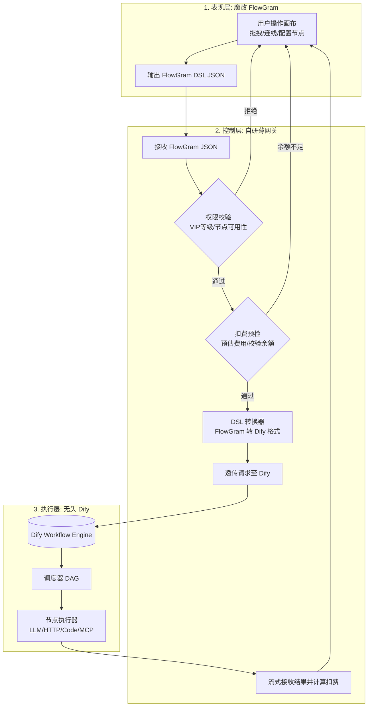

AI 工作流平台技术落地方案
=========================

## 一、 架构总览：混合三层架构

本方案摒弃了“从零造轮子”和“重度魔改现有平台”的极端，采用**解耦的混合架构**。

### 各层职责划分

1. **表现层 (FlowGram)**：仅负责画布渲染、交互体验、节点表单配置和状态管理。输出标准的 FlowGram JSON。
2. **控制层 (自研薄网关)**：系统的“大脑”。负责用户鉴权、VIP 权限拦截、节点级扣费计算、以及**最关键的 DSL 格式转换**。
3. **执行层 (Dify 无头模式)**：系统的“肌肉”。仅作为纯执行引擎，接收转换后的 Dify DSL，负责调度执行（调用 AI、跑 JS 沙箱、请求 API），并将结果流式返回。

---

## 二、 为什么选择此方案？（决策依据）

| 对比项                 | 本方案                                             | 纯魔改 Dify                                  | 纯 React Flow + 自研引擎                           |
| :--------------------- | :------------------------------------------------- | :------------------------------------------- | :------------------------------------------------- |
| **前端画布体验** | ⭐⭐⭐⭐⭐FlowGram 原生交互极佳，支持固定/自由布局 | ⭐⭐⭐Dify 画布可魔改，但受限于其原有框架    | ⭐⭐React Flow 需从零写连线/对齐/缩放，体验难调优  |
| **后端引擎成本** | ⭐⭐⭐⭐⭐复用 Dify 成熟引擎，免维护沙箱/MCP/调度  | ⭐⭐⭐⭐自带引擎，但深度魔改容易导致升级困难 | ⭐需从零实现 DAG 调度、JS 沙箱、并发控制，深不见底 |
| **核心业务可控** | ⭐⭐⭐⭐⭐扣费和权限完全在网关层，100% 自主可控    | ⭐⭐⭐需侵入 Dify 源码加拦截器，耦合度高     | ⭐⭐⭐⭐⭐100% 自主，但代价是后端全量开发          |
| **综合开发周期** | **约 3-4 周** (主要集中在网关转换器)         | 约 4-6 周 (前后端魔改联调)                   | 约 2-3 个月 (前后端均需重度开发)                   |

---

## 三、 关键技术点与实现路径

### 1. 前端：基于 FlowGram 定制画布

* **初始化**：使用 `npx @flowgram.ai/create-app@latest` 拉取基础模板，选择自由布局 以适应 AI 工作流的灵活连线。
* **节点注册**：为你的业务注册自定义节点（如 `MyLLMNode`, `MyHTTPNode`）。每个节点包含两部分：
  * `render`: 节点在画布上的外观。
  * `form`: 节点的配置面板（选择模型、填写 Prompt、配置 API Headers 等）。
* **数据输出**：监听画布变更，将节点和连线数据序列化为 FlowGram 的标准 JSON 格式，供后续提交。

### 2. 网关：自研控制层的核心逻辑

建议使用 Node.js (NestJS) 或 Go (Gin) 实现，因为它们处理高并发和流式响应较好。

* **拦截器模式**：所有前端发起的 `/run-workflow` 请求必先经过此层。
* **权限校验**：解析 FlowGram JSON 中的 `nodes` 数组，判断当前用户 VIP 等级是否有权使用这些节点类型。若无权，直接拒绝并提示前端。
* **扣费预检**：根据节点配置（如使用的模型、预估循环次数）计算预扣费金额。若用户余额不足，拒绝执行。
* **DSL 转换器 (核心开发点)**：
  * 将 FlowGram 的 `nodes` 映射为 Dify DSL 的 `nodes`。
  * 将 FlowGram 的 `edges` 映射为 Dify DSL 的 `edges`。
  * 将节点内的配置参数（如 Prompt 模板）转换为 Dify 期望的格式。

### 3. 引擎：无头部署 Dify

* **部署**：使用 Docker Compose 标准部署开源版 Dify。
* **应用创建**：在 Dify 后台创建一个“空白工作流”应用，获取其 API Key。
* **执行接口**：你的自研网关调用 Dify 的 `POST /v1/workflows/run` 接口，并务必设置 `response_mode: "streaming"`。
* **流式透传**：网关接收到 Dify 的 SSE（Server-Sent Events）流式数据后，原样透传给前端 FlowGram 画布，实现打字机效果或节点执行进度展示。

---

## 四、 开发计划与里程碑 (预估 4 周)

### 第一周：基础搭建与跑通链路

* **目标**：打通“FlowGram 画布 -> 网关 -> Dify 执行”的最简链路。
* **任务**：
  1. 本地部署 Dify，创建空白应用，测试 API 调用。
  2. 初始化 FlowGram 项目，跑通官方 Demo。
  3. 在 FlowGram 中实现一个最简单的 `LLM` 节点（仅含 Prompt 输入）。
  4. 编写极简网关，接收 JSON，硬编码转换为 Dify 格式并调通执行。

### 第二周：核心节点开发与 DSL 转换

* **目标**：完善业务所需的基础节点，完成完整的转换器。
* **任务**：
  1. 在 FlowGram 中实现 `HTTP 请求` 节点和 `代码执行` 节点的配置表单。
  2. 在网关层编写完整的 DSL 转换逻辑，支持这三大基础节点的任意拓扑结构。
  3. 处理变量引用（如节点 A 的输出作为节点 B 的输入），这是最难的部分，需仔细对齐两边的变量作用域逻辑。

### 第三周：商业逻辑接入（扣费与权限）

* **目标**：系统具备商业化能力。
* **任务**：
  1. 设计用户余额表和扣费流水表。
  2. 在网关层实现权限拦截中间件。
  3. 实现扣费逻辑：执行前冻结余额，执行中根据 Dify 返回的实际 Token 用量计算最终费用并扣除，失败则解冻。

### 第四周：体验优化与联调测试

* **目标**：产品化打磨，准备上线。
* **任务**：
  1. 前端处理流式数据，展示节点执行状态（成功/失败/运行中）和中间输出。
  2. 异常处理：Dify 执行超时、API 报错等情况的兜底提示。
  3. 画布交互优化：保存草稿、加载已有工作流、JSON 格式校验。
  4. 全链路压测，确保网关不成为性能瓶颈。

---

## 五、 风险预警与应对策略

1. **DSL 转换复杂度风险**
   * *风险*：FlowGram 和 Dify 对“变量作用域”和“循环/条件分支”的表达可能不一致，导致转换困难。
   * *应对*：第一期**砍掉复杂的 Loop 和 Condition 节点**，只做线性流程和简单分支。待核心链路稳定后，再逐步支持复杂控制流。
2. **Dify 版本升级兼容性**
   * *风险*：Dify 更新后，其内部 DSL 格式或 API 接口可能变化，导致你的网关失效。
   * *应对*：**锁定 Dify 版本**（如固定使用 v0.6.x）。不要盲目追新版本，待新版本稳定且有必要时再人工适配转换器。
3. **流式响应中断处理**
   * *风险*：网络波动导致 Dify 到网关、或网关到前端的 SSE 连接断开，造成“扣了费但没看到结果”。
   * *应对*：网关层需具备 SSE 断线重连机制；前端需具备结果补偿机制（如通过任务 ID 轮询最终结果）。

---

**总结**：这份方案通过“组合拳”的方式，将最难的前端画布和后端执行引擎交给了成熟的开源方案，而将最核心的商业逻辑留给自己。只要攻克了“DSL 转换”这个咽喉要道，你就能以最低的成本、最快的速度搭建出一个高可控、体验好的 AI 工作流平台。
