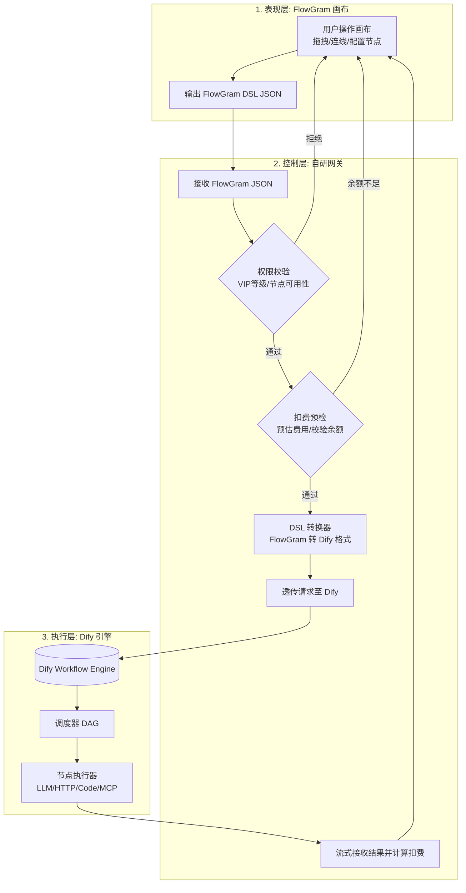

# futureFlow：可部署的 AI 工作流平台

futureFlow 是一个面向单账号/个人开发者场景的 AI 工作流 MVP：可视化编排、草稿/发布快照与版本历史、平台 API、模板建流、Webhook/定时自动化、运行审计、计费保护和管理员运维均可用。它不是静态演示页；每次线上调用都会经过鉴权、准入、运行记录和计费流水。

> 当前明确不包含团队空间、成员管理和 RBAC。它们需要以租户数据模型为基础，不能用现有单用户字段临时拼接，见文末「当前边界」。

---

## 0. 快速开始

### 一键启动

**Windows（推荐）：**

```bat
start.bat
```

**跨平台（pnpm 命令）：**

```bash
# 1. 创建环境变量文件（首次启动自动生成）
pnpm run env:init

# 2. 安装依赖
pnpm install

# 3. 一键启动完整服务
pnpm start
```

启动脚本会自动完成：

1. 从 `.env.example` 复制生成 `.env`（首次启动）
2. 安装 pnpm workspace 依赖
3. 启动全部 Docker Compose 服务（PostgreSQL、Dify API/Worker/Web、代码 Sandbox、SSRF Proxy、Redis、Weaviate）
4. 等待数据库、SSRF Proxy、Sandbox 与 Dify API 健康，并等待 Dify 初始化任务成功退出
5. 自动创建 Dify 管理员和 futureFlow 管理员，将 Dify Console 会话加密保存到 PostgreSQL
6. 发布工作流时自动创建独立 Dify 应用、导入 DSL、发布并生成独立执行 Key
7. 为 PostgreSQL、网关 JWT、Dify 等生成本机随机密钥（futureFlow 管理员默认密码为固定值 `futureFlow@`，可在 `.env` 中覆盖）

首次使用只需在 `.env` 填写模型供应商的 `LLM_API_KEY`（以及需要时调整模型地址/名称）；Dify Console 授权、应用和执行 Key 不需要手工配置。

### 访问地址

| 服务          | 地址                          | 说明                                |
| ------------- | ----------------------------- | ----------------------------------- |
| FlowGram 画布 | http://localhost:3000         | 拖拽编排工作流                      |
| 网关 API      | http://localhost:3001         | 鉴权/扣费/DSL 转换                  |
| Dify 控制台   | http://localhost:8080         | 可选的 Dify 状态查看与高级运维      |
| 健康检查      | http://localhost:3001/healthz | 网关和数据库就绪状态                |

### 首次登录与管理员

一键启动默认创建 futureFlow 管理员：用户名 `admin`，默认密码 `futureFlow@`（保存在本机 `.env` 的 `GATEWAY_BOOTSTRAP_ADMIN_PASSWORD`，可自行修改后重新初始化）。应用日志不会输出密码；账号存在时不会重复创建或覆盖。部署方可在环境升级完成后显式设置 `GATEWAY_BOOTSTRAP_ADMIN_ENABLED=false` 关闭后续初始化。

旧版生成的 `.env` 会在首次启动时一次性迁移到环境格式 v2，开启管理员和受控 Dify 的一键初始化并写入版本标记。迁移后再次显式关闭开关会被保留，不会在每次启动时强制改回。

从旧版本升级时，如果数据库中仍有使用公开旧密码的 `demo` 管理员，请在对外开放服务前登录后修改、封禁或删除该账号；新版本不会静默覆盖已有账号凭据。

网关默认只监听 `127.0.0.1`。只有在确需跨主机访问时才设置 `GATEWAY_HOST=0.0.0.0`（或指定地址），并同时收紧 `CORS_ORIGIN`、主机防火墙和反向代理访问控制。

---

## 1. 架构总览

futureFlow 采用**解耦的混合三层架构**：



### 各层职责

| 层级                        | 职责                                                 |
| --------------------------- | ---------------------------------------------------- |
| **表现层** (FlowGram) | 画布渲染、交互体验、节点表单配置、状态管理           |
| **控制层** (自研网关) | 用户鉴权、VIP 权限拦截、节点级扣费计算、DSL 格式转换 |
| **执行层** (Dify)     | 纯执行引擎，接收 Dify DSL，调度执行并流式返回结果    |

---

## 2. 已实现功能

### 全局体验

- 统一视觉令牌和 Semi UI 覆盖样式
- 左侧导航：创建画布、模板库、创建 Key
- 仪表盘、工作流列表、模板库、登录页、个人中心、管理页的统一视觉语言
- 图标降级处理，避免图标缺失时出现空白控件

### 画布与节点编辑

- 画布主界面、节点面板、节点标题、配置项与运行结果使用中文文案
- 可运行并可发布节点：开始、结束、大语言模型、文本处理、图片处理、视频处理、变量赋值、条件/多条件分支、数组批处理、API 请求、代码执行；实际可用范围同时受下方账号等级权限约束
- 变量节点支持新建变量，以及在线性或确定支配路径上修改已有顶层变量；浏览器试运行和 Dify 发布都会编译为 JavaScript 代码节点。分支汇合处存在歧义的赋值会用中文错误明确拒绝
- 全局变量当前未启用：变量面板只显示不可编辑的“全局变量（未启用）”空分组。FlowGram 的浏览器全局作用域无法可靠映射到 Dify 0.15.3，因此本地试运行和发布都会拒绝旧草稿中的 `global` 引用；需要跨节点传值时请使用开始节点输入、上游节点输出或变量赋值节点
- 注释和分组属于画布辅助节点，发布时会安全忽略；继续和中断仍标记为“暂不可运行”，不会进入数组批处理首期运行语义
- 草稿自动保存（停止操作 1.5 秒后）和手动保存（Ctrl/Command + S）
- 发布不可变快照与版本历史
- LLM 节点侧边编辑器（带错误边界）
- 画布工具栏：适应视图、自动布局、切换连线、鸟瞰图、撤销/重做
- 节点菜单：编辑标题、移出容器、创建副本、自动布局、删除
- 试运行面板：输入表单、JSON 模式、实时流式输出

### 账号等级与节点权限

| 账号等级 | 可发布、可执行节点 | 说明 |
| -------- | ------------------ | ---- |
| 免费版 | 开始、结束、大语言模型、文本处理、图片处理、视频处理、变量赋值、条件分支、多条件分支 | API 请求、代码执行和数组批处理在节点面板中显示“专业版”并禁用 |
| 专业版 / 企业版 | 免费版全部节点，以及 API 请求、代码执行、数组批处理 | 仍受各节点自身的运行边界和安全校验约束 |

继续和中断节点当前对所有账号等级都不可运行或发布。节点面板负责提前提示并禁用无权限能力，网关在发布和执行入口还会再次校验，已有草稿或直接调用接口不能绕过权限。

### 中文内容节点

- **文本处理**：组合、格式化或传递文本，支持引用上游变量，输出 `text`
- **图片处理**：接收图片 URL 与说明，提供画布预览，输出 `url`、`caption`、`mediaType`
- **视频处理**：接收视频 URL、封面 URL 与说明，提供画布预览，输出 `url`、`poster`、`caption`、`mediaType`
- 图片和视频节点负责承载、预览与传递媒体信息；生成、识别或转码能力可通过大语言模型或 API 请求节点接入

### 代码节点调研与运行边界

- FlowGram 示例工程原生带有代码节点表单，`runtime-js@1.0.12` 也带 JavaScript 执行器；原始示例默认使用异步函数，但当前浏览器运行器只能稳定执行同步 `main`
- Dify 的代码节点支持 Python 和 JavaScript。首期选择**同步 JavaScript**，因为它可以同时在浏览器 QuickJS 和 Dify Sandbox 中执行，最容易保持“画布试运行 = 发布运行”的输入输出契约
- 脚本需声明 `function main({ params })`，通过 `params` 读取输入，并返回与节点输出定义对应的对象；当前明确拒绝 `async function main`
- Python 更适合数据分析和 Python 生态，但若现在开放，就必须新增服务端试运行接口、资源配额、依赖白名单和独立安全回归；在这些能力完成前不展示一个只能发布、不能本地可靠试跑的 Python 选项
- 画布“试运行”由浏览器中的 FlowGram `runtime-js` 执行，其底层使用 QuickJS，仅用于编辑阶段预览与调试
- 工作流发布后，网关会把代码节点转换为 Dify DSL，由独立的 Dify Sandbox 执行；浏览器试运行与发布运行是两个执行环境，浏览器结果不能视为生产安全边界
- 当前集成目标 Dify 0.15.3 的代码节点输出结构不接受 `boolean` / `array[boolean]`；网关发布时会将布尔输出兼容为 `number` / `array[number]`，运行结果以 `1/0` 表示真/假，避免发布成功但云端执行失败

### 数组批处理节点

- 数组批处理面向首期可验证范围：每个工作流最多一个节点，单层串行执行，输入仅支持 `array[string]` / `array[number]`，最多 20 项；第 21 项会明确失败，不会静默截断
- 子画布固定为“块开始 → 一个同步 JavaScript → 块结束”，逐项代码只能读取当前项 `item` 和序号 `index`，并且只能声明一个字符串或数字输出；布尔输出按数字 `1/0` 兼容
- 当前不支持嵌套批处理、并行、继续、中断，以及批处理内部的 API、大语言模型、媒体或变量节点。整个数组批处理节点可以删除，但不能创建副本；其内部固定节点和连线不能删除、移出或复制，避免保存出本地能画但云端不能运行的结构
- 发布时网关将子画布转换为 Dify 0.15.3 的 `iteration`、`iteration-start` 和内部 `code`，外部结束节点读取批处理的 `output`；本地 `runtime-js` 与 Dify 内部代码都执行 20 项上限门禁

### API 请求节点

- 请求方法：`GET`、`POST`、`PUT`、`PATCH`、`DELETE`、`HEAD`
- 身份认证：无需认证、Bearer 令牌、API Key 自定义请求头、Basic 认证
- 参数配置：请求 URL、查询参数和请求头均支持引用上游变量；请求体支持无请求体、JSON 和纯文本
- 运行策略：可配置 `1–120000` 毫秒超时和 `0–10` 次网络失败重试；浏览器试运行会为每次重试创建独立超时信号
- API Key 请求头名称必须是合法的固定 HTTP Header 名称；Basic 认证的用户名和密码必须使用非空常量；Bearer/API Key 的密钥可引用开始节点输入，避免把生产密钥写进画布
- 输出字段：响应正文、响应头和状态码可以直接传给条件、文本、代码或结束节点
- 浏览器试运行受浏览器 CORS 策略约束；发布后由 Dify HTTP 节点执行，并通过 SSRF Proxy 受控访问外部地址
- 当前已覆盖扣子类 API 节点最常用的请求、认证、变量引用、超时、重试与结构化响应链路，但**不宣称与扣子完全等价**：文件/二进制上传、OAuth、独立凭据保险库、自动分页、SSL 开关和失败分支仍属于后续能力；未实现的选项不会在界面中伪装成可用

### 运行结果导出

本地试运行或已发布版本执行结束（成功或失败）后都可点击“打包下载 ZIP”。两种入口生成的压缩包都固定包含 `manifest.json`、`结果摘要.md`、`完整结果.json`、`节点执行记录.json`；存在对应数据时还会包含 `工作流输入.json`、`文本输出.txt` 和 `工作流输出.json`。

- 已发布版本的运行面板会把流式文本、节点执行记录和令牌数、步骤数、耗时等统计写入压缩包
- 本地浏览器试运行会从结束节点输出中提取常见文本字段，并把逐节点调试报告、运行状态、开始/结束时间、耗时和节点数写入压缩包；没有可提取文本时不会生成 `文本输出.txt`
- 两种压缩包都会保留图片/视频 URL 等结构化结果，但不会主动抓取第三方媒体二进制，以避免浏览器 CORS、超大文件和服务端 SSRF 风险
- 输入和结果中的凭据命名字段会隐藏；已识别的凭据值即使被上游回显到摘要、文本附件、节点记录或输出中，也会统一替换为“已隐藏”

### 个人中心与工作流

- 个人资料编辑（修改用户名/邮箱）
- API Key 管理（创建/撤销）
- 工作流列表、空状态、统计信息
- 模板库（问答、翻译、内容大纲）

### 网关与执行

- JWT/API Key 双鉴权模式
- VIP 等级节点权限控制
- 扣费服务：预冻结 → 实际扣费 → 失败退款
- DSL 转换器：FlowGram JSON ↔ Dify DSL
- SSE 流式透传
- 客户端断开会立即终止对应的 Dify 请求，并把运行标记为已取消、释放预冻结余额；事件流最多保留必要摘要，并设置 10,000 条 / 32 MiB 总量门禁
- 已发布版本通过版本专属 Dify 应用运行；Dify 未配置时明确报错，不静默切换执行语义

### 管理员后台

- 仪表盘统计（用户/Key/工作流/运行数/Token/费用/7天趋势）
- 用户管理（调整余额/修改VIP/封禁/删除）
- API Key 管理（全站列表/吊销）
- 工作流管理、运行记录、余额流水

### 自动化触发器

- Webhook 触发（一次性密钥 URL）
- 定时触发（固定分钟间隔）
- 幂等保护（Idempotency-Key）

---

## 3. 三层 API Key 体系

| 层级                   | 用途                                 | 格式           | 来源                    | 管理方式                                          |
| ---------------------- | ------------------------------------ | -------------- | ----------------------- | ------------------------------------------------- |
| **平台 API Key** | 外部系统调用 futureFlow 工作流 API   | `ff-<32hex>` | 个人中心创建            | 数据库哈希存储，支持创建/撤销                     |
| **LLM API Key**  | Dify 模型节点调用 DeepSeek/OpenAI 等 | `sk-xxx`     | 环境变量`LLM_API_KEY` | 服务端同步到 Dify Provider，浏览器与画布不可见   |
| **Dify Bridge**  | 网关调用 Dify Service API            | 不暴露         | 一键启动自动授权        | 每个发布版本独立建应用/Key，数据库 AES-GCM 加密保存 |

### 平台 API Key（用户管理）

```bash
# 创建 API Key（需 JWT 登录）
curl -X POST http://localhost:3001/user/api-keys \
  -H "Authorization: Bearer <JWT>" \
  -H "Content-Type: application/json" \
  -d '{"name": "生产环境"}'

# 调用已发布工作流
curl -X POST http://localhost:3001/workflows/<WORKFLOW_ID>/execute \
  -H "Authorization: Bearer ff-xxxxxxxxxxxxxxxx" \
  -H "Content-Type: application/json" \
  -d '{"inputs":{"query":"你好，请介绍 futureFlow"}}'
```

### LLM API Key（服务端受控）

```env
# .env
LLM_API_KEY=sk-your-deepseek-key
LLM_API_HOST=https://api.deepseek.com
LLM_DEFAULT_MODEL=deepseek-chat
```

- 画布上的 LLM 节点只暴露模型名称、温度、提示词等业务参数
- API Key 和 API Host 由网关读取；保存 Dify 管理员授权时，若 Provider 尚未配置，会自动写入并验证
- Provider 已生效时不会重复覆盖；密钥轮换可临时设置 `DIFY_FORCE_LLM_PROVIDER_SYNC=true` 后重新保存授权
- 首次 Provider 验证会调用一次模型接口，可能产生极少量供应商用量，界面会明确提示
- LLM 密钥只由服务端管理，不进入画布 JSON、浏览器或运行结果包

---

## 4. 执行引擎选择逻辑

```
用户调用 POST /workflows/:id/execute
        │
        ▼
   鉴权校验（JWT 或 ff- API Key）
        │
        ▼
   已发布版本存在专属 Dify 应用？
    ├─ 是 → 调用 Dify Service API（SSE 流式）
    │      └─ Dify 执行代码、API 和模型节点
    └─ 否 → 返回明确配置错误，不执行其他工作流或旧草稿
```

### 运行边界

草稿通过画布“试运行”在浏览器运行时调试；生产运行只接受已发布的不可变版本。Dify 未配置或发布版本尚未同步时，网关返回错误，不会偷偷改用不同引擎。

---

## 5. 受控 Dify 集成

futureFlow 不要求把 Dify `app-*` Service API Key 或 Console Token 粘贴到 `.env`。本地一键启动会用自动生成的 Dify 管理员凭据登录，等待授权可用后将 access/refresh token 以 AES-256-GCM 加密保存到 PostgreSQL；失败会阻止网关进入就绪状态。此后平台在**每个工作流版本发布时**自动创建专属 Dify 工作流应用、导入并发布不可变 DSL 快照，再生成专属 Service API Key。接口、页面和日志均不回显凭据明文。

下面的手动预检与授权接口主要用于外部 Dify、授权轮换或显式关闭自动初始化的部署；默认本地启动无需调用。

### 安全预检与授权分级

```bash
# 零成本安全预检（不接触管理员凭据、不触发模型费用）
curl -H "Authorization: Bearer <FUTUREFLOW_ADMIN_JWT>" \
  http://localhost:3001/admin/dify/preflight

# 只读验证管理员授权（不保存、不建应用/Key、不执行模型）
curl -X POST http://localhost:3001/admin/dify/validate-authorization \
  -H "Authorization: Bearer <FUTUREFLOW_ADMIN_JWT>" \
  -H "Content-Type: application/json" \
  -d '{"email":"admin@example.com","password":"<DIFY_PASSWORD>"}'

# 保存授权并启用自动建应用/Key
curl -X POST http://localhost:3001/admin/dify/bootstrap \
  -H "Authorization: Bearer <FUTUREFLOW_ADMIN_JWT>" \
  -H "Content-Type: application/json" \
  -d '{"email":"admin@example.com","password":"<DIFY_PASSWORD>"}'
```

---

## 6. 管理员后台

管理员后台地址：http://localhost:3000/admin

### 功能模块

| 模块                   | 功能说明                                                                                    |
| ---------------------- | ------------------------------------------------------------------------------------------- |
| **仪表盘**       | 统计注册用户数、API Key 数、工作流数、运行总次数、Token 消耗与总费用；展示最近 7 天运行趋势 |
| **用户管理**     | 查看所有用户、调整余额、修改 VIP 等级、封禁/解封、删除用户                                  |
| **API Key 管理** | 查看全站所有 API Key，一键吊销任意 Key                                                      |
| **工作流管理**   | 查看所有用户创建的工作流                                                                    |
| **运行记录**     | 查看全站工作流运行历史                                                                      |
| **余额流水**     | 查看所有余额变动记录                                                                        |

### 管理员 API 接口

所有接口需要 JWT Token 且 `role = 'admin'`：

```
GET    /admin/stats                    # 仪表盘统计
GET    /admin/dify/status              # Dify 授权状态
GET    /admin/dify/preflight           # 零凭据安全预检
POST   /admin/dify/validate-authorization # 只读验证管理员授权
POST   /admin/dify/bootstrap           # 保存授权并启用自动建应用
POST   /admin/dify/rotate-key          # 轮换指定应用 Key
GET    /admin/users                    # 用户列表
PATCH  /admin/users/:id/balance        # 调整余额
PATCH  /admin/users/:id/vip            # 修改 VIP
PATCH  /admin/users/:id/status         # 修改状态
DELETE /admin/users/:id                # 删除用户
GET    /admin/api-keys                 # API Key 列表
DELETE /admin/api-keys/:id             # 吊销 API Key
GET    /admin/workflows                # 工作流列表
GET    /admin/runs                     # 运行记录
GET    /admin/balance-logs             # 余额流水
```

---

## 7. 测试与验证

### 快速验证（无需外部服务）

```bash
# 类型检查 + 核心测试 + 网关/前端生产构建
pnpm run verify

# 只运行平台核心测试
pnpm run test:platform
```

### 模糊测试

`test:platform` 包含 20,000 组以上 FlowGram-to-Dify 确定性回归测试（10,000 组合法图、10,000 组应拒绝的非法图，并附带数组批处理专项变异），覆盖 JSON/YAML DSL 序列化、节点与连线引用完整性、环、自环、孤儿节点、重复边、固定子画布和批处理类型边界等场景。数组批处理还可分别运行 `gateway` 包的 `test:batch-loop` 与根目录的 `test:batch-loop-runtime`，后者真实验证 `[1,2,3] → [2,4,6]`、空数组、布尔 `1/0` 兼容和 21 项拒绝。

可通过环境变量调整：

```bash
FUTUREFLOW_FUZZ_SEED=0x1234      # 更换随机种子
FUTUREFLOW_FUZZ_CASES=50000      # 控制每类数量（上限 100,000）
```

### 集成测试

覆盖登录注册、工作流 CRUD、模板建流、发布快照与版本恢复、哈希 API Key、Webhook/定时触发器、SSE 执行、输入校验与幂等保护、扣费流水、管理员操作、用户删除与 Key 吊销。

### 全新卷一键验收

```bash
# 仅检查随机容器名、端口、卷和网络隔离，不创建资源
pnpm run test:fresh-volume -- --preflight-only

# 创建并在结束时删除一组独立测试卷，真实验证冷启动和重启幂等性
pnpm run test:fresh-volume -- --confirm-isolated-volumes
```

该验收不会调用手动 Dify 授权接口，也不会写入 Console Token；它会验证默认管理员登录、自动加密授权、两个无模型工作流各自的应用/DSL/执行 Key，以及完整重启后不重复创建。随机测试项目与现有容器、卷、端口和 `.env` 隔离。

---

## 8. 生产部署

### 环境变量配置

网关在所有运行模式下都会拒绝缺失、过短或仍为占位符的 JWT 密钥；`pnpm run env:init` 会生成安全随机值。生产环境还会拒绝以下不安全配置：

- 默认或过短的 JWT 密钥（< 32 字符）
- 示例数据库密码
- 通配符 CORS（`*`）
- 缺失的执行引擎配置
- 非正数的限流/超时参数

### 启动前检查

```bash
# 执行数据库迁移
pnpm --filter futureflow-gateway migration:run

# 启动生产网关
pnpm --filter futureflow-gateway start:prod

# 健康检查
curl http://localhost:3001/healthz
```

### Dify 版本锁定

当前 `docker-compose.yml` 固定 Dify 版本为 **0.15.3**，代码执行环境固定为 Dify Sandbox **0.2.10**。升级前必须对 DSL 转换、Console 导入、代码/HTTP 节点与 SSE 执行做兼容性回归。

Dify API 和 Worker 的代码、HTTP 节点依赖 Sandbox 与 SSRF Proxy。推荐使用 `pnpm start`，启动脚本会等待 Proxy、Sandbox 和 Dify API 健康；手动编排容器时也必须保持相同的依赖和健康检查顺序。Dify 0.15.3 固定要求代码执行请求启用 Sandbox 网络，因此默认 `ENABLE_NETWORK=true`；Sandbox 与 Proxy 仅在隔离的 Docker 网络通信，不向宿主机暴露端口，HTTP(S) 出网必须继续经过带 ACL 的 SSRF Proxy。

Dify API、Dify 控制台和 futureFlow 网关默认都只绑定宿主机 `127.0.0.1`。`pnpm env:init` 会为两套 PostgreSQL、网关 JWT、可选管理员初始化、Dify 管理员、Dify `SECRET_KEY`、Sandbox 和凭据加密分别生成随机密钥。已有数据库卷升级时，脚本不会擅自轮换弱数据库密码；请先备份并同步修改数据库角色密码与 `.env`，再重启服务。其他持久密钥也应按对应迁移流程显式轮换，不要直接对在线数据自动重建。SSRF Proxy 会拒绝 loopback、私网、link-local、云元数据和内部域名目标，生产部署仍应结合出口防火墙与 DNS 策略做第二层限制。若受控桌面环境将公网域名合成解析到 `198.18.0.0/15`，可通过 `DIFY_SSRF_SYNTHETIC_DNS_ALLOWED_DOMAINS` 逐个列出可信域名；默认 `.invalid` 不放行，IP 字面量和未列出的域名仍会被拒绝。

---

## 9. 与扣子工作流的能力对比

> 对比口径：扣子产品会随地区、版本和套餐持续变化。下表以扣子类成熟工作流平台的常见能力维度为参照，只统计 futureFlow 当前仓库已经暴露并可验证的能力；Dify 底层存在但 futureFlow 尚未提供节点、配置或完整链路的功能，仍记为“缺失”。“部分”表示基础链路可用，但不等同于扣子的完整实现。

| 能力维度 | 状态 | futureFlow 当前范围与主要差距 |
| -------- | ---- | ----------------------------- |
| 大语言模型 | 已有 | 支持模型名称、温度、系统/用户提示词、上游变量引用和 Dify 流式执行；模型供应商与密钥由服务端统一配置 |
| 条件与多条件分支 | 已有 | 支持条件分支、多条件分支以及发布前引用和拓扑校验 |
| 变量 | 部分 | 支持新建、引用和在确定支配路径上修改顶层变量；分支汇合歧义会拒绝，但全局变量未启用，也没有会话级持久变量 |
| 文本节点 | 已有 | 支持组合、格式化、引用和传递文本结果 |
| 图片/视频承载 | 部分 | 支持 URL、封面、说明、预览和结构化传递；不上传、下载或持久化媒体二进制，也不提供媒体资产库 |
| API 请求 | 部分 | 支持常用方法、查询参数、请求头、JSON/文本请求体、Bearer/API Key/Basic、超时、重试和结构化响应；缺少 OAuth、文件/二进制上传、自动分页、独立失败分支和凭据中心 |
| JavaScript 代码 | 部分 | 浏览器 QuickJS 与 Dify Sandbox 均执行严格的同步 `main` 契约；不支持异步 JavaScript、外部依赖包或任意网络访问 |
| 数组批处理 | 部分 | 支持最多 20 项的字符串/数字数组单层串行处理；内部固定为一个同步 JavaScript 节点，不支持嵌套、并行或混合其他业务节点 |
| 发布版本 | 已有 | 支持草稿、不可变发布快照、版本历史和版本专属 Dify 应用 |
| 运行记录 | 已有 | 持久化运行状态、节点记录、耗时、步骤、令牌与计费信息，并提供管理员查询 |
| 结果 ZIP | 已有 | 本地试运行和已发布运行均可导出摘要、完整结果、节点记录及可用的输入/输出文件；媒体只保存 URL 等结构化信息 |
| RAG / 知识库 | 缺失 | 未提供知识库管理、切片、向量检索、召回配置或 RAG 节点；底层 Weaviate/Dify 组件存在不代表平台已开放该能力 |
| 插件 / MCP | 缺失 | 未提供插件市场、自定义工具注册、MCP Server 配置、鉴权或工具节点 |
| 数据库节点 | 缺失 | 未提供数据库连接管理、SQL/NoSQL 查询、数据表写入或事务控制节点 |
| 文件与 OCR | 缺失 | 未提供文件上传、对象存储、文档解析、表格抽取、OCR 或文件类型变量 |
| 子工作流 | 缺失 | 未提供工作流复用、参数映射、嵌套调用、版本锁定或递归保护 |
| 多轮会话 | 缺失 | 当前按一次性工作流输入执行，没有会话状态、历史消息、记忆或上下文窗口管理 |
| 审批与等待 | 缺失 | 未提供人工审批、表单回填、事件等待、暂停/恢复或长任务状态机 |
| 异常分支与补偿 | 缺失 | API 节点只有网络失败重试；没有节点级捕获、失败分支、工作流重试策略、回滚补偿或死信队列 |
| Python 代码 | 缺失 | Dify Sandbox 虽能执行 Python，但 futureFlow 未开放服务端试运行、依赖白名单、资源配额与一致性测试，因此界面不展示 Python |
| 原生图片/视频生成 | 缺失 | 可用 API 或模型节点接入外部服务，但没有原生生成节点、任务轮询、素材管理、转码或内容审核链路 |
| 企业凭据中心 | 缺失 | LLM 与 Dify 密钥由服务端管理，API 节点也可引用开始输入；但没有面向用户/团队的加密凭据库、权限范围、审计和轮换策略 |

按影响面看，优先补齐顺序应是：先建立文件类型与企业凭据中心，再扩展 OAuth/API、插件/MCP、数据库和 RAG；随后增加子工作流、多轮会话、审批等待与异常补偿；Python 和原生媒体生成应在服务端沙箱、资源配额和安全回归完善后开放。以上均为差距与建议，不代表当前已实现。

---

## 10. 当前边界与下一阶段

| 状态     | 能力                               | 说明                                                                                     |
| -------- | ---------------------------------- | ---------------------------------------------------------------------------------------- |
| 本轮不做 | 团队空间、成员与 RBAC              | 现有数据按用户隔离；企业多租户需要 workspace、membership、角色策略和资源归属迁移后再实现 |
| 已交付   | Dify 发布版本隔离                  | 每个发布版本拥有独立 Dify 应用与独立加密 Service API Key                                 |
| 后续设计 | Cron、重试策略、取消与死信队列     | 当前提供固定间隔和执行失败记录                                                           |
| 上线运维 | 真实模型供应商探针、告警、备份演练 | `/healthz` 只检查平台数据库                                                            |

---

## 端口配置

| 服务          | 端口 | 说明                                   |
| ------------- | ---- | -------------------------------------- |
| FlowGram 画布 | 3000 | 前端                                   |
| 网关 API      | 3001 | 后端（默认仅绑定 `127.0.0.1`）         |
| Dify 控制台   | 8080 | Dify Web                               |
| Dify API      | 5001 | Dify Service API                       |
| PostgreSQL    | 5432 | 网关数据库（冲突时自动改用 5433-5450） |

---

## 技术栈

| 层级     | 技术                                 |
| -------- | ------------------------------------ |
| 前端     | React + FlowGram + Semi UI + Rsbuild |
| 网关     | NestJS + TypeORM + PostgreSQL        |
| 执行引擎 | Dify 0.15.3 (Docker)                 |
| 部署     | Docker Compose + pnpm workspace      |
