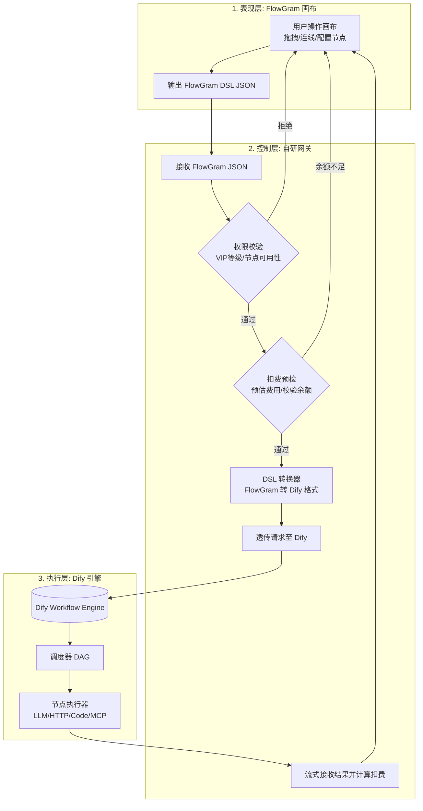

# futureFlow：可部署的 AI 工作流平台

futureFlow 是一个面向单账号/个人开发者场景的 AI 工作流 MVP：可视化编排、草稿/发布快照与版本历史、平台 API、模板建流、Webhook/定时自动化、运行审计、计费保护和管理员运维均可用。它不是静态演示页；每次线上调用都会经过鉴权、准入、运行记录和计费流水。

> 当前明确不包含团队空间、成员管理和 RBAC。它们需要以租户数据模型为基础，不能用现有单用户字段临时拼接，见文末「当前边界」。

---

## 0. 快速开始

### 一键启动

**Windows（推荐）：**

```bat
start.bat
```

**跨平台（pnpm 命令）：**

```bash
# 1. 创建环境变量文件（首次启动自动生成）
pnpm run env:init

# 2. 安装依赖
pnpm install

# 3. 一键启动完整服务
pnpm start
```

启动脚本会自动完成：

1. 从 `.env.example` 复制生成 `.env`（首次启动）
2. 安装 pnpm workspace 依赖
3. 启动全部 Docker Compose 服务（PostgreSQL + Dify 全栈）
4. 等待数据库就绪后启动网关和前端
5. 自动创建默认管理员账号

### 访问地址

| 服务          | 地址                          | 说明                                |
| ------------- | ----------------------------- | ----------------------------------- |
| FlowGram 画布 | http://localhost:3000         | 拖拽编排工作流                      |
| 网关 API      | http://localhost:3001         | 鉴权/扣费/DSL 转换                  |
| Dify 控制台   | http://localhost:8080         | Dify 初次账号初始化与模型供应商配置 |
| 健康检查      | http://localhost:3001/healthz | 网关和数据库就绪状态                |

### 默认账号

首次启动时自动创建：

| 账号     | 密码           | 角色   | VIP | 余额   |
| -------- | -------------- | ------ | --- | ------ |
| `demo` | `demo123456` | 管理员 | pro | 100 元 |

> **安全提醒**：生产环境请务必修改默认密码！

---

## 1. 架构总览

futureFlow 采用**解耦的混合三层架构**：



### 各层职责

| 层级                        | 职责                                                 |
| --------------------------- | ---------------------------------------------------- |
| **表现层** (FlowGram) | 画布渲染、交互体验、节点表单配置、状态管理           |
| **控制层** (自研网关) | 用户鉴权、VIP 权限拦截、节点级扣费计算、DSL 格式转换 |
| **执行层** (Dify)     | 纯执行引擎，接收 Dify DSL，调度执行并流式返回结果    |

---

## 2. 已实现功能

### 全局体验

- 统一视觉令牌和 Semi UI 覆盖样式
- 左侧导航：创建画布、模板库、创建 Key
- 仪表盘、工作流列表、模板库、登录页、个人中心、管理页的统一视觉语言
- 图标降级处理，避免图标缺失时出现空白控件

### 画布与节点编辑

- 支持节点：Start、LLM、条件/多条件分支、HTTP、代码、循环
- 草稿自动保存（停止操作 1.5 秒后）和手动保存（Ctrl/Command + S）
- 发布不可变快照与版本历史
- LLM 节点侧边编辑器（带错误边界）
- 画布工具栏：适应视图、自动布局、切换连线、鸟瞰图、撤销/重做
- 节点菜单：编辑标题、移出容器、创建副本、自动布局、删除
- 试运行面板：输入表单、JSON 模式、实时流式输出

### 个人中心与工作流

- 个人资料编辑（修改用户名/邮箱）
- API Key 管理（创建/撤销）
- 工作流列表、空状态、统计信息
- 模板库（问答、翻译、内容大纲）

### 网关与执行

- JWT/API Key 双鉴权模式
- VIP 等级节点权限控制
- 扣费服务：预冻结 → 实际扣费 → 失败退款
- DSL 转换器：FlowGram JSON ↔ Dify DSL
- SSE 流式透传
- Dify 未配置时自动降级为直接 LLM 模式

### 管理员后台

- 仪表盘统计（用户/Key/工作流/运行数/Token/费用/7天趋势）
- 用户管理（调整余额/修改VIP/封禁/删除）
- API Key 管理（全站列表/吊销）
- 工作流管理、运行记录、余额流水

### 自动化触发器

- Webhook 触发（一次性密钥 URL）
- 定时触发（固定分钟间隔）
- 幂等保护（Idempotency-Key）

---

## 3. 三层 API Key 体系

| 层级                   | 用途                                 | 格式           | 来源                    | 管理方式                                          |
| ---------------------- | ------------------------------------ | -------------- | ----------------------- | ------------------------------------------------- |
| **平台 API Key** | 外部系统调用 futureFlow 工作流 API   | `ff-<32hex>` | 个人中心创建            | 数据库哈希存储，支持创建/撤销                     |
| **LLM API Key**  | 网关调用大模型（DeepSeek/OpenAI 等） | `sk-xxx`     | 环境变量`LLM_API_KEY` | 自动内置，用户无感                                |
| **Dify Bridge**  | 网关调用 Dify Service API            | 不暴露         | 一次管理员授权          | 自动建应用、自动生成 Key、数据库 AES-GCM 加密保存 |

### 平台 API Key（用户管理）

```bash
# 创建 API Key（需 JWT 登录）
curl -X POST http://localhost:3001/user/api-keys \
  -H "Authorization: Bearer <JWT>" \
  -H "Content-Type: application/json" \
  -d '{"name": "生产环境"}'

# 调用已发布工作流
curl -X POST http://localhost:3001/workflows/<WORKFLOW_ID>/execute \
  -H "Authorization: Bearer ff-xxxxxxxxxxxxxxxx" \
  -H "Content-Type: application/json" \
  -d '{"inputs":{"query":"你好，请介绍 futureFlow"}}'
```

### LLM API Key（网关内置）

```env
# .env
LLM_API_KEY=sk-your-deepseek-key
LLM_API_HOST=https://api.deepseek.com
LLM_DEFAULT_MODEL=deepseek-chat
```

- 画布上的 LLM 节点只暴露模型名称、温度、提示词等业务参数
- API Key 和 API Host 完全由网关管理，安全且便于轮换
- 当 Dify 未配置时，网关降级为直接调用大模型 API

---

## 4. 执行引擎选择逻辑

```
用户调用 POST /workflows/run
        │
        ▼
   鉴权校验（JWT 或 ff- API Key）
        │
        ▼
   Dify 已配置？
    ├─ 是 → 调用 Dify Service API（SSE 流式）
    │      └─ Dify 内部调用大模型（使用 Dify 自身的 Key）
    └─ 否 → 降级模式：直接调用大模型 API
           └─ 使用环境变量 LLM_API_KEY（网关内置）
```

### 降级限制

降级到直接 LLM 模式时，仅支持 `start/llm/end/condition/multi-condition` 节点，包含其他节点类型（HTTP、Code 等）会返回 400 错误。

---

## 5. 受控 Dify 集成

futureFlow 不要求把 Dify `app-*` Service API Key 粘贴到 `.env`。管理员完成一次 Dify Console 授权后，平台会在**每个工作流版本发布时**自动创建专属 Dify 工作流应用、导入不可变快照，并生成专属 Service API Key。密钥以 AES-256-GCM 加密后存入 PostgreSQL；接口、页面和日志均不回显明文。

### 安全预检与授权分级

```bash
# 零成本安全预检（不接触管理员凭据、不触发模型费用）
curl -H "Authorization: Bearer <FUTUREFLOW_ADMIN_JWT>" \
  http://localhost:3001/admin/dify/preflight

# 只读验证管理员授权（不保存、不建应用/Key、不执行模型）
curl -X POST http://localhost:3001/admin/dify/validate-authorization \
  -H "Authorization: Bearer <FUTUREFLOW_ADMIN_JWT>" \
  -H "Content-Type: application/json" \
  -d '{"email":"admin@example.com","password":"<DIFY_PASSWORD>"}'

# 保存授权并启用自动建应用/Key
curl -X POST http://localhost:3001/admin/dify/bootstrap \
  -H "Authorization: Bearer <FUTUREFLOW_ADMIN_JWT>" \
  -H "Content-Type: application/json" \
  -d '{"email":"admin@example.com","password":"<DIFY_PASSWORD>"}'
```

---

## 6. 管理员后台

管理员后台地址：http://localhost:3000/admin

### 功能模块

| 模块                   | 功能说明                                                                                    |
| ---------------------- | ------------------------------------------------------------------------------------------- |
| **仪表盘**       | 统计注册用户数、API Key 数、工作流数、运行总次数、Token 消耗与总费用；展示最近 7 天运行趋势 |
| **用户管理**     | 查看所有用户、调整余额、修改 VIP 等级、封禁/解封、删除用户                                  |
| **API Key 管理** | 查看全站所有 API Key，一键吊销任意 Key                                                      |
| **工作流管理**   | 查看所有用户创建的工作流                                                                    |
| **运行记录**     | 查看全站工作流运行历史                                                                      |
| **余额流水**     | 查看所有余额变动记录                                                                        |

### 管理员 API 接口

所有接口需要 JWT Token 且 `role = 'admin'`：

```
GET    /admin/stats                    # 仪表盘统计
GET    /admin/dify/status              # Dify 授权状态
GET    /admin/dify/preflight           # 零凭据安全预检
POST   /admin/dify/validate-authorization # 只读验证管理员授权
POST   /admin/dify/bootstrap           # 保存授权并启用自动建应用
POST   /admin/dify/rotate-key          # 轮换指定应用 Key
GET    /admin/users                    # 用户列表
PATCH  /admin/users/:id/balance        # 调整余额
PATCH  /admin/users/:id/vip            # 修改 VIP
PATCH  /admin/users/:id/status         # 修改状态
DELETE /admin/users/:id                # 删除用户
GET    /admin/api-keys                 # API Key 列表
DELETE /admin/api-keys/:id             # 吊销 API Key
GET    /admin/workflows                # 工作流列表
GET    /admin/runs                     # 运行记录
GET    /admin/balance-logs             # 余额流水
```

---

## 7. 测试与验证

### 快速验证（无需外部服务）

```bash
# 类型检查 + 核心测试 + 网关/前端生产构建
pnpm run verify

# 只运行平台核心测试
pnpm run test:platform
```

### 模糊测试

`test:platform` 包含 20,000 组 FlowGram-to-Dify 确定性回归测试（10,000 组合法图、10,000 组应拒绝的非法图），覆盖 JSON/YAML DSL 序列化、节点与连线引用完整性、环、自环、孤儿节点、重复边等场景。

可通过环境变量调整：

```bash
FUTUREFLOW_FUZZ_SEED=0x1234      # 更换随机种子
FUTUREFLOW_FUZZ_CASES=50000      # 控制每类数量（上限 100,000）
```

### 集成测试

覆盖登录注册、工作流 CRUD、模板建流、发布快照与版本恢复、哈希 API Key、Webhook/定时触发器、SSE 执行、输入校验与幂等保护、扣费流水、管理员操作、用户删除与 Key 吊销。

---

## 8. 生产部署

### 环境变量配置

生产环境启动会拒绝以下不安全配置：

- 默认或过短的 JWT 密钥（< 32 字符）
- 示例数据库密码
- 通配符 CORS（`*`）
- 缺失的执行引擎配置
- 非正数的限流/超时参数

### 启动前检查

```bash
# 执行数据库迁移
pnpm --filter futureflow-gateway migration:run

# 启动生产网关
pnpm --filter futureflow-gateway start:prod

# 健康检查
curl http://localhost:3001/healthz
```

### Dify 版本锁定

当前 `docker-compose.yml` 固定 Dify 版本为 **0.15.3**，升级前必须对 DSL 转换、Console 导入与 SSE 执行做兼容性回归。

---

## 9. 当前边界与下一阶段

| 状态     | 能力                               | 说明                                                                                     |
| -------- | ---------------------------------- | ---------------------------------------------------------------------------------------- |
| 本轮不做 | 团队空间、成员与 RBAC              | 现有数据按用户隔离；企业多租户需要 workspace、membership、角色策略和资源归属迁移后再实现 |
| 已交付   | Dify 发布版本隔离                  | 每个发布版本拥有独立 Dify 应用与独立加密 Service API Key                                 |
| 后续设计 | Cron、重试策略、取消与死信队列     | 当前提供固定间隔和执行失败记录                                                           |
| 上线运维 | 真实模型供应商探针、告警、备份演练 | `/healthz` 只检查平台数据库                                                            |

---

## 端口配置

| 服务          | 端口 | 说明                                   |
| ------------- | ---- | -------------------------------------- |
| FlowGram 画布 | 3000 | 前端                                   |
| 网关 API      | 3001 | 后端                                   |
| Dify 控制台   | 8080 | Dify Web                               |
| Dify API      | 5001 | Dify Service API                       |
| PostgreSQL    | 5432 | 网关数据库（冲突时自动改用 5433-5450） |

---

## 技术栈

| 层级     | 技术                                 |
| -------- | ------------------------------------ |
| 前端     | React + FlowGram + Semi UI + Rsbuild |
| 网关     | NestJS + TypeORM + PostgreSQL        |
| 执行引擎 | Dify 0.15.3 (Docker)                 |
| 部署     | Docker Compose + pnpm workspace      |
