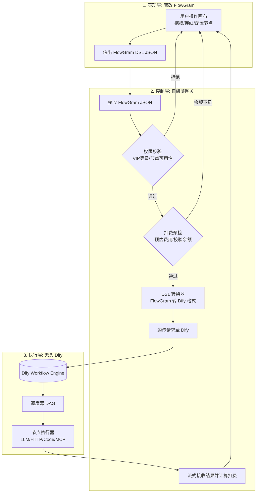

futureFlow：可部署的 AI 工作流平台
================================

futureFlow 是一个面向单账号/个人开发者场景的 AI 工作流 MVP：可视化编排、草稿/发布快照与版本历史、平台 API、模板建流、Webhook/定时自动化、运行审计、计费保护和管理员运维均可用。它不是静态演示页；每次线上调用都会经过鉴权、准入、运行记录和计费流水。

> 当前明确不包含团队空间、成员管理和 RBAC。它们需要以租户数据模型为基础，不能用现有单用户字段临时拼接，见文末「当前边界」。

## 零、 一键启动(快速开始)

futureFlow 提供全栈启动脚本，会启动 PostgreSQL、Dify API/Worker/Web、Redis、Weaviate、网关和 FlowGram 画布。

### Windows(推荐)

```bat
start.bat
```

脚本会自动:
1. 从 `.env.example` 复制生成 `.env`(首次启动)
2. 安装 pnpm workspace 依赖
3. 启动全部 Compose 服务（futureFlow PostgreSQL + 完整 Dify）
4. 等待 PostgreSQL、Dify API 就绪后启动网关(:3001)和 FlowGram 画布(:3000)
5. 若主机的 5432 已被其它数据库占用，自动安全地改用 5433–5450 中的空闲端口；不会停止或替换已有服务

### 跨平台(pnpm 命令)

```bash
# 1. 创建环境变量文件(首次；会生成本机 Dify 凭据加密密钥)
pnpm run env:init

# 2. 编辑 .env：配置 LLM，或按下方「受控 Dify 集成」完成一次管理员授权
#    不要手动复制 Dify app-* 密钥；futureFlow 会自动创建、加密保存并轮换

# 3. 安装依赖
pnpm install

# 4. 一键启动完整容器和应用服务
pnpm start
```

### 启动后访问

| 服务 | 地址 | 说明 |
|------|------|------|
| FlowGram 画布 | http://localhost:3000 | 拖拽编排工作流 |
| 网关 API | http://localhost:3001 | 鉴权/扣费/DSL 转换 |
| Dify 控制台 | http://localhost:8080 | Dify 初次账号初始化与模型供应商配置 |

### 画布保存机制

- 编辑画布或修改工作流名称后，系统会在停止操作 1.5 秒后自动保存草稿
- 顶部栏会显示“未保存”“正在自动保存”“已保存”或“自动保存失败”状态
- 支持点击“保存”或按 `Ctrl/Command + S` 立即保存
- 保存请求会按顺序执行，避免连续编辑时旧内容覆盖新内容
- 关闭、刷新或主动返回工作流列表时，未完成保存的内容会触发离开提醒

### 完整功能验证

无需连接外部 Dify 或真实 PostgreSQL，即可运行核心回归和内存数据库 HTTP 集成测试：

```bash
# 类型检查 + 核心测试 + 网关/前端生产构建
pnpm run verify

# 只运行平台核心测试
pnpm run test:platform
```

集成测试覆盖登录注册、工作流 CRUD、模板建流、发布快照与版本恢复、哈希 API Key、Webhook/固定间隔触发器、SSE 执行、输入校验与幂等保护、扣费流水、管理员操作、用户删除与 Key 吊销。

### 生产前验收与启动

`pnpm run verify` 证明代码、内存数据库集成链路和前端构建可通过；发布前还必须对真实 PostgreSQL 运行迁移与健康检查：

```bash
# 生产环境：先备份数据库，再执行迁移；该迁移只允许向前执行，不提供破坏性回滚
pnpm --filter futureflow-gateway migration:run

# 会再次检查迁移状态，再启动生产网关
pnpm --filter futureflow-gateway start:prod

# 数据库就绪检查（供反向代理、容器编排使用）
curl http://localhost:3001/healthz
```

生产模式启动会拒绝以下不安全配置：默认或过短的 JWT 密钥、示例数据库密码、通配符 CORS、缺失的执行引擎配置，以及非正数的限流/超时参数。请在 `.env` 中至少设置安全的 `GATEWAY_JWT_SECRET`、`POSTGRES_PASSWORD`、明确的 `CORS_ORIGIN`，并配置可用的 `LLM_API_KEY`、传统 `DIFY_API_KEY` 或受控 Dify Bridge。

`POST /healthz` 返回 `200` 只代表网关和平台数据库就绪；模型供应商和 Dify 的可用性请同时通过 `GET /workflows/dify-status` 观察。首次上线不应使用默认 `demo` 管理员密码。

### 三层 API Key 自动配置

启动脚本会自动从 `.env` 读取下列密钥,**用户无需在画布上手动填写**:

| 密钥 | 环境变量 | 用途 | 格式 |
|------|----------|------|------|
| LLM API Key | `LLM_API_KEY` | 网关调用 DeepSeek/OpenAI | `sk-xxx` |
| Dify Bridge（推荐） | 数据库加密凭据 | 自动创建应用与 Service API Key | 管理员一次授权 |
| Dify API Key（兼容） | `DIFY_API_KEY` | 网关调用已存在的 Dify Service API | `app-xxx` |

详见下方「六、 API Key 体系」章节。

---

## 一、 架构总览:混合三层架构

本方案摒弃了"从零造轮子"和"重度魔改现有平台"的极端,采用**解耦的混合架构**。



### 各层职责划分

1. **表现层 (FlowGram)**:仅负责画布渲染、交互体验、节点表单配置和状态管理。输出标准的 FlowGram JSON。
2. **控制层 (自研薄网关)**:系统的"大脑"。负责用户鉴权、VIP 权限拦截、节点级扣费计算、以及**最关键的 DSL 格式转换**。
3. **执行层 (Dify 无头模式)**:系统的"肌肉"。仅作为纯执行引擎,接收转换后的 Dify DSL,负责调度执行(调用 AI、跑 JS 沙箱、请求 API),并将结果流式返回。

---

## 二、 为什么选择此方案?(决策依据)

| 对比项                 | 本方案                                             | 纯魔改 Dify                                  | 纯 React Flow + 自研引擎                           |
| :--------------------- | :------------------------------------------------- | :------------------------------------------- | :------------------------------------------------- |
| **前端画布体验** | ⭐⭐⭐⭐⭐FlowGram 原生交互极佳,支持固定/自由布局 | ⭐⭐⭐Dify 画布可魔改,但受限于其原有框架    | ⭐⭐React Flow 需从零写连线/对齐/缩放,体验难调优  |
| **后端引擎成本** | ⭐⭐⭐⭐⭐复用 Dify 成熟引擎,免维护沙箱/MCP/调度  | ⭐⭐⭐⭐自带引擎,但深度魔改容易导致升级困难 | ⭐需从零实现 DAG 调度、JS 沙箱、并发控制,深不见底 |
| **核心业务可控** | ⭐⭐⭐⭐⭐扣费和权限完全在网关层,100% 自主可控    | ⭐⭐⭐需侵入 Dify 源码加拦截器,耦合度高     | ⭐⭐⭐⭐⭐100% 自主,但代价是后端全量开发          |
| **综合开发周期** | **约 3-4 周** (主要集中在网关转换器)         | 约 4-6 周 (前后端魔改联调)                   | 约 2-3 个月 (前后端均需重度开发)                   |

---

## 三、 关键技术点与实现路径

### 1. 前端:基于 FlowGram 定制画布

* **初始化**:使用 `npx @flowgram.ai/create-app@latest` 拉取基础模板,选择自由布局 以适应 AI 工作流的灵活连线。
* **节点注册**:为你的业务注册自定义节点(如 `MyLLMNode`, `MyHTTPNode`)。每个节点包含两部分:
  * `render`: 节点在画布上的外观。
  * `form`: 节点的配置面板(选择模型、填写 Prompt、配置 API Headers 等)。
* **数据输出**:监听画布变更,将节点和连线数据序列化为 FlowGram 的标准 JSON 格式,供后续提交。

### 2. 网关:自研控制层的核心逻辑

建议使用 Node.js (NestJS) 或 Go (Gin) 实现,因为它们处理高并发和流式响应较好。

* **拦截器模式**:所有前端发起的 `/run-workflow` 请求必先经过此层。
* **权限校验**:解析 FlowGram JSON 中的 `nodes` 数组,判断当前用户 VIP 等级是否有权使用这些节点类型。若无权,直接拒绝并提示前端。
* **扣费预检**:根据节点配置(如使用的模型、预估循环次数)计算预扣费金额。若用户余额不足,拒绝执行。
* **DSL 转换器 (核心开发点)**:
  * 将 FlowGram 的 `nodes` 映射为 Dify DSL 的 `nodes`。
  * 将 FlowGram 的 `edges` 映射为 Dify DSL 的 `edges`。
  * 将节点内的配置参数(如 Prompt 模板)转换为 Dify 期望的格式。

### 3. 引擎:无头部署 Dify

* **部署**:使用 Docker Compose 标准部署开源版 Dify。
* **应用配置**:管理员只授权一次 Dify Console。每次发布都会自动创建该版本专属的 Dify 工作流应用和 Service API Key；密钥 AES-256-GCM 加密保存，不复用为全局运行目标。
* **执行接口**:你的自研网关调用 Dify 的 `POST /v1/workflows/run` 接口,并务必设置 `response_mode: "streaming"`。
* **流式透传**:网关接收到 Dify 的 SSE(Server-Sent Events)流式数据后,原样透传给前端 FlowGram 画布,实现打字机效果或节点执行进度展示。

---

## 四、 实现状态与演进方向

### 已交付：基础链路

* **当前状态**:已打通“FlowGram 画布 → 网关 → 已配置 Dify 或直接 LLM”的执行主链路；登录、草稿保存、发布快照、外部 API 与运行审计均在网关中执行。
* **已交付**:
  1. PostgreSQL 迁移、健康检查与生产环境安全配置校验。
  2. 基于 FlowGram 的可视化画布、草稿自动保存与手动保存。
  3. Start、LLM、条件/多条件分支、HTTP、代码节点的转换与准入校验；Loop 执行仍未开放。
  4. NestJS 网关的 JWT/API Key 鉴权、发布不可变快照、模板库、Webhook/固定间隔触发器、限流、幂等和运行记录。

### 第二周:核心节点开发与 DSL 转换

* **目标**:完善业务所需的基础节点,完成完整的转换器。
* **任务**:
  1. 在 FlowGram 中实现 `HTTP 请求` 节点和 `代码执行` 节点的配置表单。
  2. 在网关层编写完整的 DSL 转换逻辑,支持这三大基础节点的任意拓扑结构。
  3. 处理变量引用(如节点 A 的输出作为节点 B 的输入),这是最难的部分,需仔细对齐两边的变量作用域逻辑。

### 第三周:商业逻辑接入(扣费与权限)

* **目标**:系统具备商业化能力。
* **任务**:
  1. 设计用户余额表和扣费流水表。
  2. 在网关层实现权限拦截中间件。
  3. 实现扣费逻辑:执行前冻结余额,执行中根据 Dify 返回的实际 Token 用量计算最终费用并扣除,失败则解冻。

### 第四周:体验优化与联调测试

* **目标**:产品化打磨,准备上线。
* **任务**:
  1. 前端处理流式数据,展示节点执行状态(成功/失败/运行中)和中间输出。
  2. 异常处理:Dify 执行超时、API 报错等情况的兜底提示。
  3. 画布交互优化:保存草稿、加载已有工作流、JSON 格式校验。
  4. 全链路压测,确保网关不成为性能瓶颈。

---

## 五、 风险预警与应对策略

1. **DSL 转换复杂度风险**
   * *风险*:FlowGram 和 Dify 对"变量作用域"和"循环/条件分支"的表达可能不一致,导致转换困难。
   * *应对*:当前已支持简单条件与多条件分支，并在转换与直接执行路径中校验分支端口；Loop/Iteration 仍未开放，需按目标引擎的迭代模型单独设计后再上线。
2. **Dify 版本升级兼容性**
   * *风险*:Dify 更新后,其内部 DSL 格式或 API 接口可能变化,导致你的网关失效。
   * *应对*:**锁定 Dify 版本**。当前 `docker-compose.yml` 固定为 `0.15.3`；升级前必须对 DSL 转换、Console 导入与 SSE 执行做兼容性回归，不能直接替换镜像标签。
3. **流式响应中断处理**
   * *风险*:网络波动导致 Dify 到网关、或网关到前端的 SSE 连接断开,造成"扣了费但没看到结果"。
   * *应对*:网关层需具备 SSE 断线重连机制;前端需具备结果补偿机制(如通过任务 ID 轮询最终结果)。

---

**总结**：这份方案通过"组合拳"的方式，将最难的前端画布和后端执行引擎交给了成熟的开源方案，而将最核心的商业逻辑留给自己。只要攻克了"DSL 转换"这个咽喉要道，你就能以最低的成本、最快的速度搭建出一个高可控、体验好的 AI 工作流平台。

---

## 六、 API Key 体系

futureFlow 采用三层 API Key 架构，各层职责分离、互不耦合：

| 层级 | 用途 | 格式 | 来源 | 管理方式 |
|------|------|------|------|----------|
| **平台 API Key** | 外部系统调用 futureFlow 工作流 API | `ff-<32hex>` | 个人中心创建 | 数据库哈希存储，支持创建/撤销 |
| **LLM API Key** | 网关调用大模型（DeepSeek/OpenAI 等） | `sk-xxx` | 环境变量 `LLM_API_KEY` | 自动内置，用户无感 |
| **Dify Bridge（推荐）** | 网关调用 Dify Service API | 不暴露 | 一次管理员授权 | 自动建应用、自动生成 Key、数据库 AES-GCM 加密保存 |
| **Dify API Key（兼容）** | 网关调用既有 Dify 应用 | `app-xxx` | 环境变量 `DIFY_API_KEY` | 旧部署兼容路径 |

### 平台 API Key（用户管理）

用户在个人中心创建和管理平台 API Key，用于通过 API 调用工作流：

```bash
# 创建 API Key（需 JWT 登录）
curl -X POST http://localhost:3001/user/api-keys \
  -H "Authorization: Bearer <JWT>" \
  -H "Content-Type: application/json" \
  -d '{"name": "生产环境"}'

# 调用工作流（使用 API Key 鉴权）
curl -X POST http://localhost:3001/workflows/run \
  -H "Authorization: Bearer ff-xxxxxxxxxxxxxxxx" \
  -H "Content-Type: application/json" \
  -d '{"flowgram": {...}}'
```

- 创建时返回完整明文，**仅显示一次**，请妥善保存
- 数据库仅存储 SHA-256 哈希值，无法反推明文
- 支持随时撤销（软删除）
- 鉴权中间件同时支持 JWT 和 API Key 两种方式

### 发布工作流并提供 API

工作流分为**草稿**和**已发布版本**。编辑草稿不会影响正在被外部系统调用的版本；只有点击发布后，当前版本才会生成新的线上快照。

1. 在「我的工作流」中点击 **发布**，并在 **API 调用** 中查看端点与示例。
2. 外部系统使用平台 API Key 调用已发布工作流，并仅传入 Start 节点定义的输入参数：

```bash
curl -X POST http://localhost:3001/workflows/<WORKFLOW_ID>/execute \
  -H "Authorization: Bearer ff-xxxxxxxxxxxxxxxx" \
  -H "Content-Type: application/json" \
  -d '{"inputs":{"query":"你好，请介绍 futureFlow"}}'
```

- 响应为 SSE 流，可实时接收节点状态、文本输出、Token 用量和最终结果。
- API 调用会关联到对应工作流；用户可在工作流卡片的「运行记录」中查看状态、耗时、费用与错误信息。
- 取消发布会立刻停止该端点的新调用，但不会删除草稿或历史运行记录。
- 每次发布都会固化一条不可变版本历史。可在「版本历史」中把任意历史版恢复为**草稿**；恢复不会替换线上版本，检查后仍需显式发布，避免误操作影响调用方。

### 模板库与自动化触发器

参考成熟工作流产品的「从模板开始 + 发布后自动运行」路径，futureFlow 提供 3 个内置模板（问答、翻译、内容大纲）和两类发布后触发器。模板只会创建一份可独立修改的草稿，不会修改模板本身。

| 能力 | 入口 | 规则 |
|------|------|------|
| 模板建流 | `GET /workflow-templates`、`POST /workflow-templates/:id/create-workflow` | 仅登录用户可用；生成独立草稿 |
| Webhook | `POST /workflows/:workflowId/triggers`，`type: "webhook"` | 返回一次性密钥 URL；数据库仅保存密钥哈希；可轮换、暂停、删除 |
| 定时触发 | 同一接口，`type: "schedule"` + `intervalMinutes` | 固定分钟间隔，调度状态保存在数据库，多实例通过原子认领避免同一轮重复执行 |

触发器只能绑定已发布的工作流快照。配置时会校验输入字段和类型，因此无效参数不会等到后台任务执行时才暴露。Webhook 请求可携带 `Idempotency-Key`，与平台 API 共用幂等保护；运行记录会标记来源为 `webhook` 或 `schedule`。

```bash
# 创建 Webhook（JWT 仅用于创建；调用方使用返回的专属 URL）
curl -X POST http://localhost:3001/workflows/<WORKFLOW_ID>/triggers \
  -H "Authorization: Bearer <JWT>" \
  -H "Content-Type: application/json" \
  -d '{"name":"订单创建","type":"webhook","staticInputs":{"query":"新订单"}}'

# 调用返回的 webhookUrl；请求体 inputs 会覆盖同名 staticInputs
curl -X POST '<WEBHOOK_URL>' \
  -H 'Content-Type: application/json' \
  -H 'Idempotency-Key: order-10001' \
  -d '{"inputs":{"query":"订单 10001 已创建"}}'

# 创建每小时定时触发器
curl -X POST http://localhost:3001/workflows/<WORKFLOW_ID>/triggers \
  -H "Authorization: Bearer <JWT>" \
  -H 'Content-Type: application/json' \
  -d '{"name":"每小时摘要","type":"schedule","intervalMinutes":60}'
```

V1 刻意使用固定间隔而不是 Cron 表达式；这样可以明确首个商用版本的时区、补跑和重试边界。需要日历、时区和错过执行补偿时，应新增专门的调度规格与任务队列后再开放 Cron。

### LLM API Key（网关内置）

网关从环境变量自动读取大模型 API Key，**用户无需在画布上手动配置**：

```env
# .env
LLM_API_KEY=sk-your-deepseek-key
LLM_API_HOST=https://api.deepseek.com
LLM_DEFAULT_MODEL=deepseek-chat
```

- 画布上的 LLM 节点只暴露模型名称、温度、提示词等业务参数
- API Key 和 API Host 完全由网关管理，安全且便于轮换
- 当 Dify 未配置时，网关降级为直接调用大模型 API
- 直接 LLM 模式支持引用已执行节点的变量，例如 `{{start.query}}`、`{{llm_1.result}}` 以及对象子字段
- Start、LLM、条件分支和多条件分支属于基础节点；HTTP 与代码节点仍按 VIP 等级控制。循环节点尚未开放执行，以免画布出现“可编辑但不可运行”的假能力。

### 受控 Dify 集成（按发布版本自动创建密钥）

futureFlow 不要求把 Dify `app-*` Service API Key 粘贴到 `.env`。管理员完成一次 Dify Console 授权后，平台会在**每个工作流版本发布时**自动创建一个专属 Dify 工作流应用、导入不可变快照，并生成专属 Service API Key。密钥以 AES-256-GCM 加密后存入 futureFlow PostgreSQL；接口、页面和日志均不回显明文。

1. 先在 `http://localhost:8080` 完成 Dify 的初次账号初始化，并配置 Dify 自身可用的模型供应商。
2. 在 futureFlow `.env` 设置随机且至少 32 位的 `DIFY_KEY_ENCRYPTION_SECRET`。首次由 `start.bat` / `pnpm run env:init` 创建 `.env` 时会自动生成本机随机值；生产环境必须改为由部署密钥系统持久管理的值，不能使用示例值。
3. 登录 futureFlow 后，在「我的工作流」页面点击「Dify 引擎」，输入一次 Dify 管理员邮箱/密码或 Console Token。密码只用于换取令牌，不会被 futureFlow 保存。也可使用下面的管理员 API 自动化部署。

```bash
curl -X POST http://localhost:3001/admin/dify/bootstrap \
  -H "Authorization: Bearer <FUTUREFLOW_ADMIN_JWT>" \
  -H "Content-Type: application/json" \
  -d '{"email":"admin@example.com","password":"<DIFY_PASSWORD>"}'

# 不返回明文密钥；返回授权状态和各发布版本的应用映射、密钥指纹
curl -H "Authorization: Bearer <FUTUREFLOW_ADMIN_JWT>" \
  http://localhost:3001/admin/dify/status
```

- 已发布工作流在每次「发布」时自动同步到专属 Dify 应用；若先发布、后授权，可在工作流卡片点击「同步 Dify」完成补同步。
- `POST /admin/dify/rotate-key` 可传入 `workflowId` 和 `workflowVersion`，为该专属应用生成新的 Dify Service API Key 并原子更新加密存储。
- Dify Console 会话过期时，网关先尝试使用加密的刷新令牌续期；续期失败才要求管理员再次授权。
- 启动时如果 `.env` 已提供 `DIFY_CONSOLE_TOKEN` 和真实的加密密钥，平台会自动完成首次 Console 授权；后续发布无需再手动复制任何 Dify Key。该 Console Token 不会写回 `.env`。
- `DIFY_API_KEY` 保留为兼容旧部署的后备方案；未配置任何 Dify 凭据时，网关降级为直接 LLM 模式。

### 执行引擎选择逻辑

```
用户调用 POST /workflows/run
        │
        ▼
   鉴权校验（JWT 或 ff- API Key）
        │
        ▼
   Dify 已配置？
    ├─ 是 → 调用 Dify Service API（SSE 流式）
    │      └─ Dify 内部调用大模型（使用 Dify 自身的 Key）
    └─ 否 → 降级模式：直接调用大模型 API
           └─ 使用环境变量 LLM_API_KEY（网关内置）
```

---

## 七、 管理员后台

futureFlow 内置管理员后台，用于管理用户、API Key、工作流和财务流水。仅在用户 `role = 'admin'` 时可见。

### 访问入口

登录后，管理员账号的左侧导航栏会多出 **「管理员后台」** 菜单项，或直接访问 `http://localhost:3000/admin`。

**默认管理员账号**（首次启动自动创建）：

| 账号 | 密码 | 角色 |
|------|------|------|
| `demo` | `demo123456` | `admin` |

### 功能模块

| 模块 | 功能说明 |
|------|----------|
| **仪表盘** | 统计注册用户数、API Key 数、工作流数、运行总次数、Token 消耗与总费用；展示最近 7 天运行趋势柱状图 |
| **用户管理** | 查看所有用户、调整任意用户余额、修改 VIP 等级（free/pro/enterprise）、封禁/解封账号、删除用户 |
| **API Key 管理** | 查看全站所有 API Key（含所属用户、使用时间、吊销状态），管理员可一键吊销任意 Key |
| **工作流管理** | 查看所有用户创建的工作流列表 |
| **运行记录** | 查看全站工作流运行历史（状态、Token、费用、耗时、错误信息） |
| **余额流水** | 查看所有余额变动记录（冻结/扣费/充值/退款），含变动后余额，溯源每一笔交易 |

### 管理员 API 接口

所有管理员接口位于 `http://localhost:3001/admin/*`，需要 JWT Token 且 `role = 'admin'`：

```
GET    /admin/stats                    # 仪表盘统计
GET    /admin/dify/status              # Dify 授权和发布版本映射状态（不含明文密钥）
POST   /admin/dify/bootstrap           # 一次 Console 授权，启用发布自动建应用和 Key
POST   /admin/dify/rotate-key          # 为指定专属应用轮换 Key（workflowId、workflowVersion）
GET    /admin/users                    # 用户列表（分页）
PATCH  /admin/users/:id/balance        # 调整余额 { delta, remark }
PATCH  /admin/users/:id/vip            # 修改 VIP { vipLevel }
PATCH  /admin/users/:id/status         # 修改状态 { status }
DELETE /admin/users/:id                # 删除用户
GET    /admin/api-keys                 # API Key 列表
DELETE /admin/api-keys/:id             # 吊销 API Key
GET    /admin/workflows                # 工作流列表
GET    /admin/runs                     # 运行记录
GET    /admin/balance-logs             # 余额流水
```

调用示例：

```bash
# 获取仪表盘统计
curl http://localhost:3001/admin/stats \
  -H "Authorization: Bearer <ADMIN_JWT>"

# 给用户充值 100 元
curl -X PATCH http://localhost:3001/admin/users/<USER_ID>/balance \
  -H "Authorization: Bearer <ADMIN_JWT>" \
  -H "Content-Type: application/json" \
  -d '{"delta": 100, "remark": "管理员充值"}'
```

### 普通用户提升为管理员

直接操作数据库修改 `users` 表：

```sql
-- 将某个用户提升为管理员
UPDATE users SET role = 'admin' WHERE username = '<username>';
```

---

## 八、当前边界与下一阶段

本版本已覆盖单账号工作流产品的主链路：编排 → 保存草稿 → 发布不可变快照 → API/Webhook/定时触发 → 流式运行 → 审计与计费。以下能力有意不宣称已完成：

| 状态 | 能力 | 说明 |
|------|------|------|
| 本轮不做 | 团队空间、成员与 RBAC | 现有数据按用户隔离；企业多租户需要 workspace、membership、角色策略和资源归属迁移后再实现 |
| 已交付的保护 | Dify 发布版本隔离 | 每个发布版本拥有独立 Dify 应用与独立加密 Service API Key；执行阶段只读自己的映射，不导入 DSL、不持有全局串行锁，因此不同工作流可并发运行而不会串线 |
| 后续设计 | Cron、重试策略、取消与死信队列 | 当前提供固定间隔和执行失败记录，不把它误称为完整任务编排系统 |
| 上线运维 | 真实模型供应商探针、告警、备份演练 | `/healthz` 只检查平台数据库；供应商可用性、成本与备份恢复需要部署环境持续监控 |

因此，它可以作为可部署、可验证的单账号 MVP 继续试运营；在上述边界完成前，不应以“企业多租户工作流平台”对外承诺。
